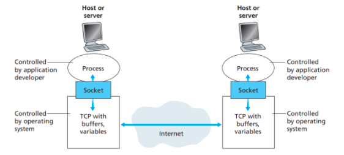
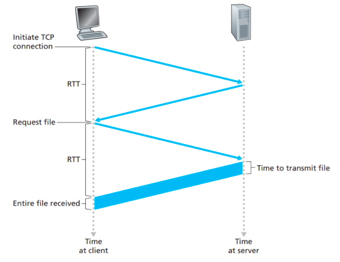
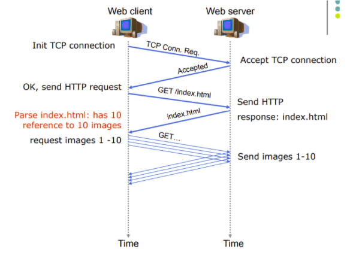
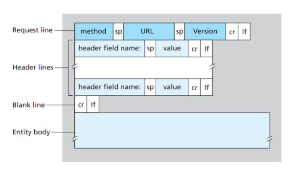
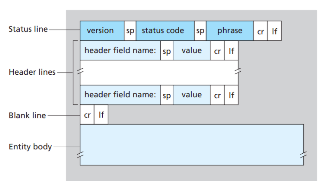
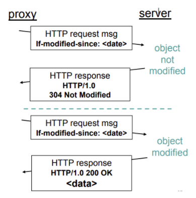
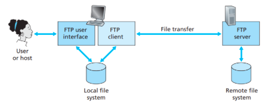
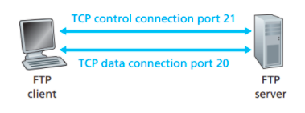
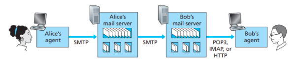

# Application Layer

## 1. Principles of Network Applications

### 1.1. Elements of network application

- Application program:
  - User agent: Interface for user to use application (e.g., web browser: Firefox, Chrome…)
  - Server program: provide service to user agent.
- Processes: running program on Operation System.
- Communication between processes:
  - On the same host: by IPC (inter-process communication).
  - Among different hosts: by socket.

### 1.2. Processes communication over internet

- Socket: an interface between application process and transport layer within a host.
- Socket is identified by:
  - IP address: is a 32-bit quantity that uniquely identifying the host.
  - Port number: is used to identify the receiving process running on the host.
  - Type of transport service (TCP or UDP)
  


- Socket API (Application Programming Interface): allow to select TCP or UDP, change parameters…

### 1.3. Network Application Architectures

An application’s architecture is distinctly different from the network architecture (e.g., the five-layer Internet architecture)

- The network architecture is fixed and provides a specific set of services to application.
- The application architecture is designed by the application developer and dictates how the application is structured over the various end systems.
- Two predominant architectural paradigms used in modern network applications:
  - The client-server architecture:
    - There is an always-on host, called the server, which services requests from many other hosts, called clients.
    - Clients do not directly communicate with each other.
    - The server has a fixed, well-known address (IP address) and is always on, a client can always contact the server by sending a packet to the server’s IP address.
    - Data center, housing a large number of hosts, is often used to create a powerful virtual server in order to avoid a single-server host becomes overwhelmed by huge number of requests.
  - The peer-to-peer (P2P) architecture:
    - There is minimal (or no) reliance on dedicated servers in data centers. Instead, the application exploits direct communication between pairs of intermittently connected hosts, called peers.
    - The peers are not owned by the service provider, but are instead desktops and laptops controlled by users.
    - P2P applications include file sharing (BitTorrent), peer-assisted download acceleration, Internet Telephony (Skype) and IPTV (Kankan and PPstream).
    - P2P architecture is self-scalability. For example, in a P2P file-sharing application, although each peer generates workload by requesting files, each peer also adds service capacity to the system by distributing files to other peers.
    - P2P architectures are also cost effective, since they normally don’t require significant server infrastructure and server bandwidth.
  - Hybrid architecture:
    - Initial contact is to a central server, used to determine info about other end-systems.
    - After this, end-systems talk directly.
  
## 2. The Web and HTTP

### 2.1. Overview of HTTP

- WWW (World Wide Web): share HTML (Hyper Text Markup Language) documents over internet.
- HTTP (Hyper Text Transfer Protocol):
  - The heart of the Web.
  - Implemented in 2 programs: a client program and a server program.
  - Client requests web objects (a file, a JPEG image, a Java applet, or a video clip) and display them on a web browser.
  - Server receives request and sends response to client.
- HTTP flows:
  - Server opens a listening TCP socket at port 80 (default).
  - Client initializes a TCP connection to server.
  - Server accepts connection request.
  - Client and Server exchange HTTP messages.
  - TCP connection closed.

### 2.2. HTTP connections

#### 2.2.1. Non-persistent HTTP

- Each TCP connection is closed after the server sends the object – the connection does not persist for other objects.

    -> At most one object is sent over a TCP connection.
- RTT (Round-trip time): is the time it takes for a small packet to travel from client to server and then back to the client.
- Three-way handshake:
  - The client sends a small TCP segment to the server, the server acknowledges and responds with a small TCP segment -> take 1 RTT.
  - The client acknowledges and sends the HTTP request message into the TCP connection back to the server -> take 1 RTT.

    -> The total response time is 2 RTTs + transmission time at the server of the HTML file.


- Shortcomings:
  - A brand-new connection must be established and maintained for each requested object.
  - For each connection, TCP buffers must be allocated and TCP variables must be kept in both the client and server -> a significant burden on the Web server.
  - Each object can be delay of 2 RTTs.

#### 2.2.2. Persistent HTTP

- The server leaves the TCP connection open after sending a response -> multiple objects can be sent over single TCP connection between client and server.
- The client can make requests for object back-to-back, without waiting for replies to pending requests (pipelining).
- When the server receives the back-to-back requests, it sends the objects back-to-back.
- The HTTP server closes a connection when it isn’t used for a certain time.


### 2.3. HTTP message format

#### 2.3.1. Request message

- Method types:
  - HTTP/1.0
    - GET
    - POST
    - HEAD: asks server to leave requested object out of response.
  - HTTP/1.1
    - GET, POST, HEAD
    - PUT: uploads file in entity body to path specified in URL field.
    - DELETE: deletes file specified in the URL field.
- General format of an HTTP request message:


- Example:
  
    ```
    GET /somedir/page.html HTTP/1.1  

    Host: www.someschool.edu 

    Connection: close 

    User-agent: Mozilla/5.0 

    Accept-language:  en-us
    ```

  - The first line is request line:
    - The GET method is used when browser requests an object.
    - The browser is requesting the object /somedir/page.html
    - The browser is implements version HTTP/1.1
  - The subsequent lines are called header lines:
    - Host: www.someschool.edu, specifies the host on which the object resides.
    - Connections: close, the browser doesn’t want persistent connections, it wants the server to close the connection after sending the requested object.
    - User-agent: specifies the user agent.
    - Accept-language: indicates that the user prefers to receive a en-us version of the object, if such an object exists on the server, else the server should send its default version.

#### 2.3.1. Response message

- General format of an HTTP response message:

- Some common status codes:
  - 200 OK: request succussed and the information is returned in the response.
  - 301 Moved Permanently: requested object moved, new location specified later in this Location header of the response message.
  - 400 Bad Request: request message not understood by server.
  - 404 Not Found: requested document not found on the server.
  - 505 HTTP Version Not Supported: the requested HTTP protocol version is not supported by the server.
- Example:
  ```
    HTTP/1.1 200 OK 
    Connection: close
    Date: Tue, 09 Aug 2011 15:44:04 GMT 
    Server: Apache/2.2.3 (CentOS)  
    Last-Modified: Tue, 09 Aug 2011 15:11:03 GMT  
    Content-Length: 6821 Content-Type: text/html  

    (data data data data data ...)
  ```

  - Status line has 3 fields: the protocol version HTTP 1.1, status code 200, corresponding status message OK.
  - Header lines:
    - Connection: close, tell the client that it is going to close the TCP connection after sending the message.
    - Date: indicates the time and date when the HTPP response was created and sent by the server.
    - Server: indicates that the message was generated by an Apache Web server.
    - Last-Modified: indicates the time and date when the object was created of last modified.
    - Content-Length: indicates the number of bytes in the object being sent.
    - Content-Type: indicates that the object in the entity body is HTML text.
  - Entity body: contains the requested object itself (data data data…)

### 2.4. Web caching

- A Web cache – also called a proxy server – is a network entity that satisfies HTTP requests on the behalf of an origin Web server.
- The web cache has its own disk storage and keeps copies of recently requested objects in this storage.
- A user’s browser can be configured so that all the HTTP requests are first directed to the web cache.
- Browser sends all HTTP request to proxy:
  - Hit: the proxy has a copy of the object stored locally -> return the object within an HTTP response message to client browser.
  - Miss: the proxy does not have the object
    - The proxy opens a TCP connection to the origin server and sends an HTTP request for the object.
    - The origin server sends the object within an HTTP response to the proxy.
    - The proxy stores a copy of received object in its local storage and send a copy to the client browser.
  
  -> A cache is both a server and a client at the same time.
- A web cache is purchased and installed by an ISP (campus, company, residential ISP…).
- Effect of web proxy:
  - Reduce Internet traffic on the access link.
  - Reduce response time.

### 2.5. Conditinal GET

- Goal: don’t send object if cache has up-to-date cached version.
- An HTTP request message is a so-called conditional GET message if:
  - The request message uses the GET method.
  - The request message includes an If-Modified-Since header.
  
  

- The server response message contains no object if cached copy is up-to-date with status line 304 Not Modified.

### 2.6. Local cache

- Web cache in the cache on the local host, not on a proxy server. 
- Local cache can be used for:
  - Offline web-browsing
  - Browse web pages more efficiently if the content of a web pages does not change, so we can use the content in the cache.

## 3. File Transfer Protocol: FTP



- Flows:
  - The user interacts with FTP through an FTP user agent.
  - The user provides the hostname of the remote host, causing the FTP client process in the local host to establish a TCP connection with the FTP server process in the remote host.
  - The user provides the user identification and password, which are sent over the TCP connection as part of FTP command.
  - Once the server has authorized the user, the user can copy one or more files stored in the local file system into the remote file system (or vice versa).
- FTP uses 2 parallel TCP connections to transfer a file:
  - A control connection: used for sending control information (user identification, password, commands…) between 2 hosts.
  - A data connection: used to actually send a file. FTP sends exactly one file over data connection and then closes the connection. If, during the same session, the user wants to transfer another file, FTP opens another data connection.
  
  -> FTP is said to sent its control information out-of-band. HTTP sends request and response header lines into the same TCP connection that carries the transferred file itself -> send its control information in-band.

  

- FTP commands and replies:
  - Each command consists of 4 upper case ASCII characters, some with optional arguments:
    - USER username: used to send the user identification to the server.
    - PASS password: used to send the user password to the server.
    - LIST: return list of files in current directory.
    - RETR filename: retrieves (gets) file.
    - STOR filename: stores (puts) file onto remote host.
  - Each command is followed by a reply, sent from server to client. The replies are three-digit numbers, with an optional message following the number:
    - 331 Username OK, password required
    - 125 Data connection already open; transfer starting
    - 425 Can’t open data connection
    - 452 Error writing file
  
## 4. Electronic Mail

- Mail User Agent (MUA): read email from server. E.g., Outlook, Thunderbird…
- Mail Transfer Agent (MTA):
  - Mail boxes for incoming mails of users.
  - Message queue for outgoing mails
  - E.g., Sendmail, MS Exchange…
- Protocol for sending mail: SMTP – Simple Mail Transfer Protocol
- Protocol for accessing mail:
  - Post Office Protocol (POP).
  - Internet Mail Access Protocol (IMAP).

### 4.1. SMTP

- SMTP transfers message from sender’s mail servers to the recipient’s mail servers.
- SMTP is much older than HTTP.
- SMTP use TCP connection at port 25.
- Drawback: restricts the body of all mail messages to simple 7-bit ASCII. It requires binary multimedia data to be encoded to ASCII before sent over SMTP and decoded back to binary after SMTP transport.
- SMTP messages and replies:
  - Messages: ASCII text: HELO, MAIL FROM, RCPT TO, DATA, QUIT + text.
  - Replies: status code and phrase: 220, 250, 354, 221…
  
### 4.2. Mail Access Protocol



- The sender’s user agent does not dialogue directly with the recipient’s mail server -> use SMTP to push the email message into the sender’s mail server.
- By having email deposited in mail server, the mail server can repeatedly try to send the message to the recipient’s mail server, every 30 minutes, until the recipient’s mail server becomes operational.
- Since SMTP is a push protocol, the recipient’s user agent cannot obtain the messages by a pull operation -> need a special mail access protocol that transfers messages from the mail server to the user agent -> Post Office Protocol – Version 3 (POP3), Internet Mail Access Protocol (IMAP), HTTP.

#### 4.2.1. POP3

- POP3 is an extremely simple mail access protocol, so that its functionality is rather limited.
- POP3 begins when the user agent opens a TCP connection to the mail server on port 110.
- With the TCP connection established, POP3 progresses through 3 phases:
  - Authorization: the user agent sends a username and a password (in the clear) to authenticate the user.
    - 2 principal commands: user \<username\> and pass \<password\>.
  - Transaction: the user agent retrieves messages.
    - The user agent can mark messages for deletion, remove deletion marks and obtain mail statistics.
    - The server responds to each command with a reply: +OK (sometimes followed by server-to-client data), used by the server to indicate that the previous command was fine; and -ERR, used by the server to indicate that something was wrong with the previous command.
  - Update: occurs after the client has issued the quit command, ending the POP3 session. The mail server deletes the messages that were marked for deletion.
- During a POP3 session between a user agent and the mail server, the POP3 server maintains some state information; in particular, it keeps track of which user messages have been marked deleted. However, the POP3 server does not carry state information across POP3 sessions. This lack of state information across sessions greatly simplifies the implementation of a POP3 server.

#### 4.2.2. IMAP

- POP3 protocol does not provide any means for a user to create remote folders and assign messages to folders.
  
  -> The IMAP protocol invented.
- IMAP is a mail access protocol; it has many more features than POP3 -> significantly more complex.
- An IMAP server will associate each message with a folder; when a message first arrives at the server, it is associated with the recipient’s INBOX folder.
- The recipient can move the message into a new folder, read the message and delete the message, IMAP also provides command to search remote folders for messages.
- An IMAP server maintains user state information across IMAP sessions.
- IMAP has commands that permit a user agent to obtain components of messages. For example, a user agent can obtain just the message header of a message of just one part of a multipart MIME message -> useful when there is a low-bandwidth connection between user agent and its mail server.

#### 4.2.3. Web-based email

- Web-based access is introduced in mid 1990s by Hotmail.
- Now Web-based email is also provided by Google, Yahoo…
- With this service, the user communicates with its remote mailbox via HTTP.
- When a recipient wants to access a message in his mailbox, the email message is sent from mail server to browser using HTTP protocol rather than the POP3 or IMAP protocol.
- When a sender wants to send an email message, the email message is sent from the browser to the mail server over HTTP rather than over SMTP. The mail server, however, still sends messages to, and receives messages from, other mail servers using SMTP.
