# The Link Layer

## 1. Introduction

- Any device that run a link-layer protocol is called a **node**.
- Nodes include hosts, routers, switches, and WiFi access points.
- The communication channels that connect adjacent nodes along the communication path is called **links**.
- A transmitting node encapsulates the datagram in a **link-layer frame** and transmits the frame into the link.

### 1.1. Link Layer services

- Possible services that can be offered by a link-layer protocol include:
  - Framing: A frame consists of a data field, in which the network-layer datagram is inserted, and a number of header fields. The structure of the frame is specified by the link-layer protocol.
  - Link access: a medium access control (MAC) protocol specifies the rules by which a frame is transmitted onto the link.
    - The MAC protocol is simple, the sender can send a frame whenever the link is idle.
    - When multiple nodes share a single broadcast link, the MAC protocol serves to coordinate the frame transmissions of the many nodes.
  - Reliable delivery: guarantees to move each network-layer datagram across the link without error.
    - A link-layer reliable delivery service can be achieved with acknowledgements and retransmissions.
    - A link-layer reliable delivery service is often used for links that are prone to high error rates, such as a wireless link, with the goal of correcting an error locally (on the link where the error occurs) rather than forcing an retransmission.
    - Link-layer reliable delivery is unnecessary for low bit-error links (fiber, coax, twisted-pair copper links) -> many wired link-layer protocols do not provide a reliable delivery service.
  - Error detection and correction: many link-layer protocols provide a mechanism to detect bit errors: transmitting node include error-detection bits in the frame and the receiving node perform an error check.
    - Error detection in the link layer is implemented in hardware.
    - Error correction is similar to error detection, except that the receiver not only detects when bit errors occurred in the frame but also determines exactly where in the frame the errors have occured and then corrects these errors.

### 1.2. Link Layer Implementation

- For the most part, the link layer is implemented in a **network adapter**, sometime known as a **network interface card (NIC)**.

    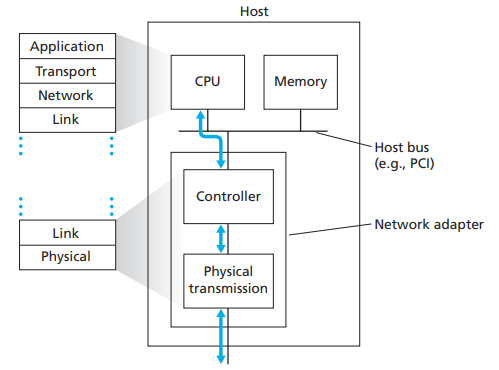

- At the heart of the network adapter is the link-layer controller, usually a single, special-purpose chip that implements many of the link-layer services.
- On the sending side, the controller takes a datagram that has been created and stored in host memory by the higher layers, encapsulates the datagram in a link-layer frame, and then transmits the frame into the communication link.
- On the receiving side, the controller receives the entire frame, and extracts the network-layer datagram. If the link layer performs error detection, the sending controller sets the error-detection bits in the frame header and the receiving controller performs error detection.
- A network adapter attched to a host's bus, where it looks much like any other I/O device to the other host component.
- Most of the link layer is implemented in hardware, part of the link layer is implemented in software that runs on the host's CPU.
  - The software components of the link layer implement higher-level link-layer functionality such as assembling link-layer addressing information and activating the controller hardware.
  - On the receiving side, link-layer software responds to controller interrupts, handling error conditions and passing datagram up to the network layer.

    -> The link layer is combination of hardware and software.

## 2. Error-Detection and -Correction techniques

### 2.1. Parity Checks

- The simplest form of error detection is the use of a single **parity bit**.
  
  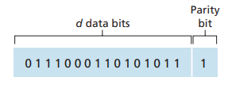

  - The sender includes one additional bit and chooses its value such that the total number of 1s in the d + 1 bits is even (or odd if in an odd parity scheme).
  - The receiver count the number of 1s in the received d + 1 bits. If an odd number of 1-valued bits are found with an even partity scheme, at least 1 bit error has occurred.

  -> Only work if the probability of multiple bit errors is extremely small.

- **Two-dimensional parity scheme**: d bits in D is divided into i rows and j columns. A parity value is computed for each row and for each column. The resulting i + j + 1 parity bits comprise the link-layer frames's error-detection bits.

    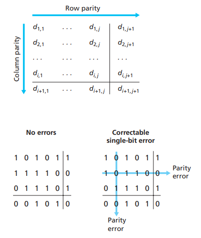

  - The parity of both the column and the row contaning the filpped bit will be in error.
  - The receiver can not only detect the fact that a single bit error has occurred, but can use the column and row indices of the column and row with parity erros to actually identify the bit that was corrupted and correct that error.
- The ability o the receiver to both detect and correct errors is known as **forward error correction (FEC)**.

### 2.2. Checksum

- In checksumming techniques, the d bit of data are treated as a sequence of k-bit integers. One simple checksumming method is to simply sum these k-bit integers and use the resulting sum as the error-detecting bits.
- Because transport-layer error detection is implemented in software, it is important to have a simple and fast error-detection scheme such as checksumming.
- On the other hand, error detection at the link layer is implemented in dedicated hardware in adapters, which can rapidly perform the more complex cyclic redundancy check (CRC) operations.

### 2.3. Cyclic Redundancy Check (CRC)

- An error-detection technique used widely in today's computer networks is based on cyclick redundancy check (CRC) codes.
- CRC codes are also known as **polynomial codes**, since it is possible to view the bit string to be sent as a polynomial whose coefficients are the 0 and 1 values in the bit string, with operations on the bit string interpreted as polynomial arithmetic.
- CRC codes operate a follows:
  - Consider d-bit piece of data, D, that sending node wants to send to the receiving node.
  - The sender and receiver must first agree on an r + 1 bit pattern, known as a generator, denote as G.
  - Choose r additional bits, R, and append them to D such that the resulting d + r bit pattern is exactly divisible by G using modulo-2 arithmetic.
  - Error checking with CRCs: The receiver devides the d + r received bits by G. If the remainder is nonzero, the receiver knows that an error has occured; otherwise the data is accepted as being correct.

    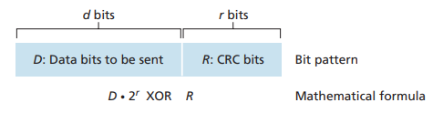

- <D, R> can be re-write in math formula D.2^r XOR R
- <D, R> divisible by G
  - D.2^r XOR R = n.G
  - D.2^r = n.G XOR R

    -> R is the remainder when D.2^r divided by G

- Example:

    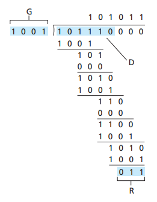

- The longer G, the more powerfull CRC.
- CRC is very effective and is used widely
  - Wifi, ATM, Ethernet...
  - Can detect all burst errors less than r + 1 bits.
  - Modulo 2 operator are implemented by hardware.

## 3. Multiple Access Links and Protocols

- There are 2 types of network links:
  - Point-to-point link: consists of a single sender ant one end of the link and the single receiver at the other end of the link.
  - Broadcast link: can have multiple sending and receiving nodes all connected to the same, single, shared broadcast channel.
- Multiple access protocols: nodes regulate their transmission into the shared broadcast channel.
- Multiple access protocols are needed in a wide variety of network settings, including both wired and wireless access networks, and satellite networks.

    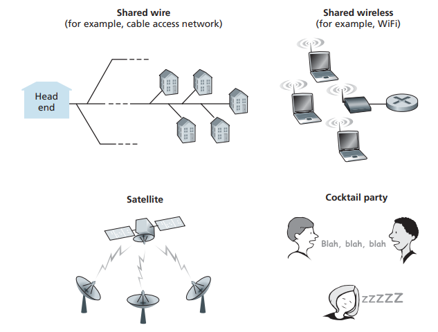

- All nodes are caple of transmitting frames, more than 2 nodes can transmit frames at the same time.

    -> All node receive multiple frames at the same time -> the transmitted frames collide at all of the receiver.

### 3.1. Channel Partitioning Protocols

- There are 2 techniques that can be used to partition a broadcast channel's bandwidth among all nodes sharing a channel:
  - Time-division multiplexing (TDM): divides time into **time frames** and further divides each time frame into N **time slots**.
    - Each time slot is then assigned to one of the N nodes.
    - Whenever a node has a packet to send, it transmits the packet's bits during its assigned time slot in the TDM frame.
    - TDM eliminates collisions and is perfectly fair: Each node get a dedicated transmission rate of R/N bps during each frame time.
    - Drawback:
      - A node is limited to an average rate of R/N bps even when it is the only node with packets to send/
      - A node must always wait for its turn in the transmission sequence.
  - Frequency-division multiplexing (FDM):  divides the R bps channel into different frequencies (each with a bandwidth of R/N) and assigns each frequency to one of the N nodes -> FDM creates N smaller channels of R/N bps out of the single, the larger R bps channel.
    - FDM shares both the advantages and drawbacks of TDM.
    - FDM avoids collisions and divides the bandwidth fairly among the N nodes. However, a node is limited to a bandwidth of R/N, even when it is the only node with packets to send.

- Code division multiple access (CDMA): assigns a different code to each node.
  - Each node uses its unique code to encode the data bits it sends.
  - Different nodes can transmit simultaneously and have their respective receivers correctly receive a sender's endcoded data bits (assuming the receiver knows the sender's code).
  - CDMA has been used in military systems and now has widespread civilian use, particularly in cellular telephony.

- Carrier sense multiple access (CSMA):
  - Rules of CSMA and CSMA with collision detection (CSMA/CD):
    - Listen before speaking: a node listens to the channel before transmitting - this is called **carried sensing**. If a fram from another node is currently being transmitted into the channel, a node then waits until it detects no trasmissions for a short amout of time and then begins transmission.
    - If someone els begins talking at the same time, stop talking: a transmitting node listens to the channel while it is trasmitting. If it detects than another node is transmitting an interfering frame, it stops transmitting and waits a random amount of time before repeating the sense-and-transmit-when-idle cycle.
  - There are still collisions because of channel propagation delay - the time it takes for a signal to propagate from one of the nodes to another. The longer this propagation delay, the larger the chance that a carrier-sensing node is not yet able to sense a trasmission that has already begun at another node in the network.

### 3.2. Random Access protocols

- The second broad class of multiple access protocols are random access protocols.
- In a random access protocol, a transmitting node always tranmits at the full rate of the channel R bps.
- When there is a collision, each node involved in the collision repeatedly retransmits its frame until its frame gets through without a collision.
  - The node doesn't nessessarily retransmit righ away. Instead it waits a random delay before retrasmitting the frame.
  - Each node chooses independent random delays -> it is possible that one of the nodes will be able to sneak its frame into the channel without a collision.
- Pros & cons:
  - Efficient at low load: 1 node can fully use the channel.
  - At high load: too many collisions.

## 4. Switched Local Area Networks

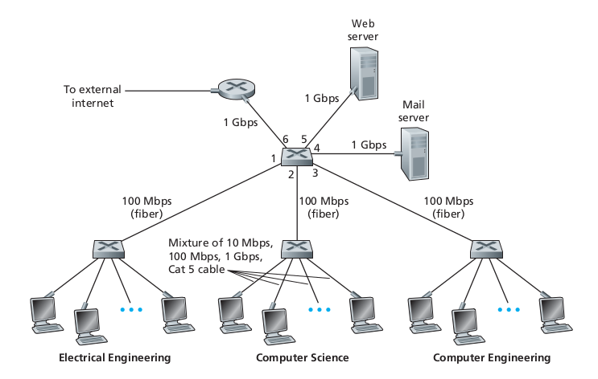

### 4.1. Link-layer Addressing and ARP

#### 4.1.1. MAC Addresses

- It is not hosts and routers that have link-layer address but rather their adapters (network interface) that have the link-layer address.
- A host or router with multiple network interfaces will have multiple link-layer addresses associated with it.
- However, link-layer switches do not have link-layer addresses because the job of link-layer swiches is to carry datagrams between host and router (this job is transparent).
- A link-layer address is called a LAN address, physical address, or a MAC address.

  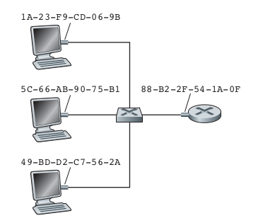

- For most LANs, the MAC address is a 6 bytes long, giving 2^48 possible MAC addresses.
- These 6-byte addersses are expressed in hexadecimal notaion, with each byte of the address expressed as pair of hexadecimal numbers.
- MAC address is unique. IEEE manages the MAC address space.
  - When a company want to manufacture adapters, it purchases a chunk of the address space consisting of 2^24 addresses for a nominal fee.
  - IEEE locates the chunk of 2^24 addresses by fixing the first 24 bits of a MAC address and letting the company create unique combinations of the last 24 bits for each adapter.
- An adapter's MAC address has a flat structure and doesn't change no matter where the adapter goes. In contrast, IP addresses have a hierachical structure (that is, a network part and a host part), and a host's IP addresses needs to be changed when the host moves, i.e, changes the network to which it is attached.
- When an adapter wants to send a frame to some destination adapter, the sending adapter inserts the destination adapter's MAC address into the frame and then sends the frame into the LAN.
  - A switch occassionally broadcast an incoming frame onto all of its interfaces.
  - An adapter may receive a frame that isn't addressed to it -> check to see whether the destination MAC address in the frame matches its own MAC address.
    - If there is a match, the  adapter extracts the enclosed datagram and passes the datagram up the protocol stack.
    - If there isn't a match, the adapter discards the frame.
  - If a sending adapter does want all the other adapters on the LAN receive the frame, it insert a special MAC broadcass address (FF-FF-FF-FF-FF-FF) into the destination address field of the frame.

#### 4.1.2. Address Resolution Protocol (ARP)

- ARP is used to tanslate between network-layer addresses (e.g. IP addresses) and link-layer addresses (MAC addresses).
- An ARP module in the sending host takes any IP address on the same LAN as input, and returns the corresponding MAC address.
  
  -> ARP resolves IP addresses only for host and router interfaces on the same subnet.

- How ARP works?
  - Each host and router has an ARP table in its memory, which contains mappings of IP addresses to MAC addresses.

  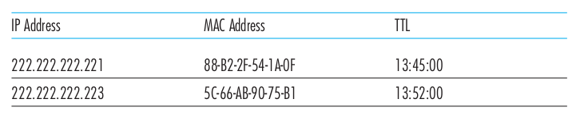

  - The ARP tale also contains a time-to-live (TTL) value, which indicates when each mapping will be deleted from the table.
    - A table does not neccessarily contain an entry for every host and router on the subnet; some may have never been enter into the table, and others may have expired.
    - A typical expiration time for an entry is 20 minutes from when an entry is placed in an ARP table.
  - First, the sender construct a special packet called an ARP packet (includes serveral fields: the sending and receiving IP and MAC addresses, both ARP query and response packets have the same format).
  - The sender passes an ARP query packet to the adater along with an indicating that the adapter should send the packet to the MAC broadcast address - FF-FF-FF-FF-FF-FF.
  - The adapter encapsulates the ARP packet in a link-layer frame, uses the broadcast address for the frame's destination address, and transmits the frame into the subnet.
  - The frame containing the ARP query is received by all the other adapters on the subnet and each adapter passes the ARP packet within the frame up to its ARP module.
  - Each of these ARP modules checks to see if its IP address matches the destination IP address in the ARP packet.
  - The One with a match sends back to the querying host a response ARP packet with the desired mapping.
  - The querying host can then update its ARP table and send its IP datagram, encapsulated in a link-layer frame whose destination MAC is that of the host or router responding to the earlier ARP query.

### 4.2. Ethernet

- The original Ethernet LAN was invented in the mid-1970s.
- The original Ethernet LAN used a coaxial bus to interconnect the nodes.
  - Ethernet with a bus topology is a broadcast LAN - all transmitted frames travel to and are processed by all adapters connected to the bus.
- By the late 1990s, most companies and universities had replaced their LANs with Ethernet installations using a hub-based star topology.
  - The host (and routers) are directly connected to a hub with twisted-pair copper wire.
  - A **hub** is a physical-layer device that acts on individual bits rather than frames. When a bit arrives from one interface, the hub simply re-creates the bit, boosts its energy strength, and transmits the bit onto all other interfaces.

    -> Hub-based star topology is also a broadcast LAN.

  - If a hub receives frames from 2 different interfaces at the same time, a collision occurs and the nodes that created the frames must retransmit.
- In the early 2000s, Ethernet installations continued to use a star topology, but the hub at the center was replaced with a **switch**.

***Ethernet Frame Structure***

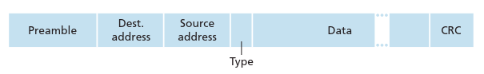

- Six fields of the Ethernet frame:
  - Data field (46 to 1,500 bytes): carries the IP datagram.
    - The maximum transmission unit (MTU) of Ethernet is 1,500 bytes -> if the IP datagram exceeds 1,500 bytes, the host hast to fragment the datagram.
    - The minimum size of the data field is 46 bytes -> if the IP datagram is less than 46 bytes, the data field has to be "stuffed" to fill it out to 46 bytes. The network layer uses the length field in the IP datagram header to remove the stuffing.
  - Destination address (6 bytes): contains the MAC address of the destination adapter. When an adapter receives an Ethernet frame, it passes the contents of the data field to the network layer if the destination MAC address matches its own address or is the MAC broadcast address; else it discards the frame.
  - Source address (6 bytes): contains the MAC address of the adapter that transmits the frame onto the LAN.
  - Type field (2 bytes): permits Ethernet to multiplex network-layer protocols. A given host may support multiple network-layer protocols using different protocols for different application -> when the Ethernet frame arrives, the adapter needs to know to which network-layer protocol it should pass (demultiplex) the contents of the data field.
  - Cyclic redundancy check (CRC) (4 bytes): allows the receiving adapter to detect bit errors in the frame.
  - Preamble (8 bytes): each of the first 7 bytes has a value of 10101010; the last byte is 10101011.
    - The first 7 bytes serve to "wake up" the receiving adapter and synchronize their clocks to that of the sender's clock.
    - The last 2 bits of the last byte alert adapter B that the "important stuff" is about to come.
- All of the Ethernet technologies provide connectionless service to the network layer.
  - When an adapter receives a frame, it runs the frame through a CRC check . When a frame fails the CRC check, the adapter discards the frame.
    - If the application is using UDP, the application in receiving host will see gaps in the data.
    - If the application is using TCP, TCP in receiving host will not acknowledge the data contained in discarded frames, causing TCP in sending host to retransmit.

### 4.3. Link-layer Switches

- The role of the switch is to receive incoming link-layer frames and forward them onto outgoing links.
- Switch itself is **transparent** to the hosts and routers in the subnet; that is, a host/router addresses a frame to another host/router (rather than addressing the frame to the switch).

#### 4.3.1. Forwarding and Filtering

- Filtering is the switch function that determines whether a frame should be forwarded to some interface or should just be dropped.
- Forwarding is the switch function that determines the interfaces to which a frame should be directed, and then movese the frame to those interfaces.
- Switch filtering and forwarding are done with a **switch table** (contains entries for some of the hosts and routers on a LAN). An entry in the switch table contains a MAC address, the switch interface that leads toward that MAC address, and the time at which the entry was placed in the table.
- Suppose a frame with destination address DD-DD-DD-DD-DD-DD-DD arrives at the switch on interface x. The switch indexes its table with the MAC address DD-DD-DD-DD-DD-DD-DD. There are 3 possible cases:
  - There is no entry in the table for the MAC address. In this case, the switch broadcasts the frame.
  - There is an entry in the table, associating DD-DD-DD-DD-DD-DD-DD with interface x. In this case, the frame is coming from a LAN segment that contains adapter DD-DD-DD-DD-DD-DD-DD. The switch performs the filtering function by discarding the frame.
  - There is an entry in the table, associating DD-DD-DD-DD-DD-DD-DD with interface y != x. In this case, the switch perform its forwarding function by putting the frame in an output buffer that precedes interface y.

#### 4.3.2. Self-learning

- A switch's table is built automatically, dynamically, and autonomously - without any intervention from a network administrator or from a configuration protocol -> swiches are **self-learning**.
  - The switch table iss initially empty.
  - For each incoming frame received on an interface, the switch stores in its table the MAC address in the frame's source address field, the interface from which the frame arrived, and the current time.
  - The switch deletes an address in the table if no frames are received with that address as the source address after some period of time (if a PC is replaced by another PC, the MAC address of the original PC will be purged from the switch table).

#### 4.3.3. Properties of Link-layer Switching

- Advantages of using switches, rather than broadcast links such as buses or hub-based star topologies:
  - Elimination of collisions: In a LAN built from switches (without hubs), there is no wasted bandwidth due to collisions.
    - The switches buffer frames and never transmit more than one frame on a segment at any one time.
    - The maximum aggregate throughput of a switch is the sum of the switch interface rates -> switches provide a significant performance improvement over LANs with broadcast links.
  - Heterogeneous links: Because a switch isolates one link from another, the different links in the LAN can operate at different spees and can run over different media.
  - Management: if an adapter malfunctions and continually sends Ethernet frames, a switch can detect the problem and internally disconnect the malfunctioning adapter. Similarly, a cable cut desconnects only that host that was using the cu cable to connect to the switch. Switches also gather statistics on bandwidth usage, collision rates, and traffic types, and make this information available to the network manager. This information can be used to debug and correct problems, and to plan how the LAN should evolve in the future.

#### 4.3.4. Switches vs Routers

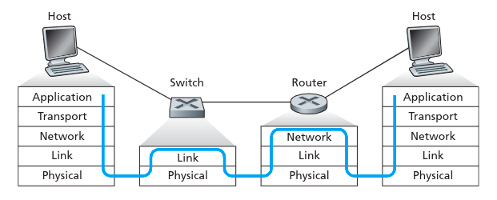

- Pros and cons of switches:
  - Switches are plug-and-play.
  - Switches can also have relatively high filtering and forwarding rates since switches have to process frames only up through layer 2.
  - To prevent the cycling of broadcast frames, the active topology of a switched network is restricted to a spanning tree. Also, a large switched network would require large ARP tables in the hosts and routers and would generate substantial ARP traffice and proccessing.
  - Switches are susceptible to broadcast storms (if one host transmits an endless stream of Ethernet broadcast frames, the switches will forward all of these frames, causing the entire network to collapse).
- Pros and cons of routers:
  - Since network addressing is often hierarchical, packets do not normally cycle through routers even when the network has redundant paths. Thus, packets are not restricted to a spanning tree and can use the best path between source and destination.
  - Since routers do not have the spannign tree restriction, they have allowed the Internet to be built with a rich topology that inclues, for example, multiple active links between Europe and North America.
  - Routers provide firewall protection against layer-2 broadcast storms.
  - Drawback:
    - Routers are not plug-and-play, they and the hosts need their IP addresses to be configured.
    - Router often have a larger processing time per packet than switches, because they have to process up through the layer-3 fields.
  
- Switches suffice for small networks consisting of a few hundred hosts have a few LAN segments, as they localize traffic and increase aggregate throughput without requiring any configuration of IP addresses.
- Larger networks consisting of thousands of hosts typically include routers within the network. The routers provide a more robust isolation of traffic, control broadcast storms, and use more intelligent routes among the hosts in the network.

## 5. Ebtables

- Ebtables is an application program used to set up and maintain the tables of rules (inside the Linux kernel) that inspect Ethernet frames.
- It is analogous to the **iptables** application, but less complicated, due to the fact that the Ethernet protocol is much simpler than the IP protocol.

### 5.1. Chains

- There are 3 ebtables tables with built-in chains in the Linux kernel. These table are used to divide functionality into different set of rules.
- Each set of rules is called a chain. Each chain is an ordered list of rules that can match Ethernet frames.
- If a rule matches an Ethernet frame, then a processing specification tells what to do with that matching frame. The processing specification is called a **target**.
- If the frame does not match the current rule in the chain, then the next rule in the chain is examined and so forth.
- The user can create new chains (user-defined chain) that can be used as the 'target' of a rule.

### 5.2. Targets

- When a frame matches a rule, then the next action performed by the kernel is specified by the target.
- The target can be one of these values:
  - ACCEPT: let the frame through.
  - DROP: the frame has to be dropped.
  - CONTINUE: the next rule has to be checked.
  - RETURN: stop traversing this chain and resume at the next rule in the pervious chain.
  - Or a jump to a user-defined chain.

### 5.3. Tables

- There are 3 ebtables tables in the Linux kernel:
  - Filter table: is the default table that the command operates on and contains 3 built-in chains: INPUT, OUTPUT, and FORWARD.
  - Nat table: is mostly used to change the MAC addresses and contains 3 built-in chains: PREROUTING, OUTPUT, and POSTROUTING.
  - Broute table: is used to make a brouter, it has 1 built-in chain: BROUTING. The target DROP and ACCEPT have a special meaning in the broute table.
    - DROP actually means the frame has to be routed.
    - ACCEPT means the frame has to be bridged.
