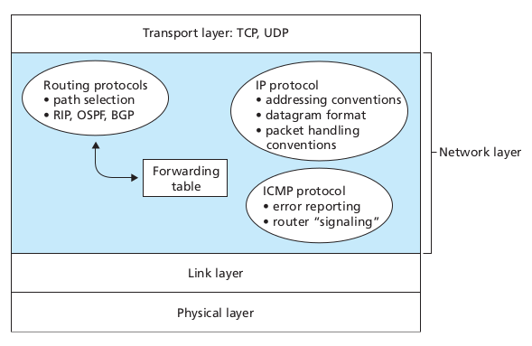
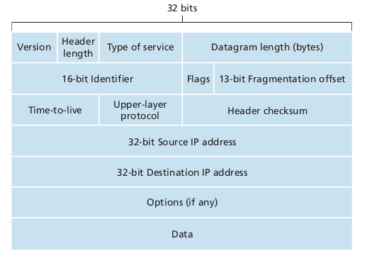
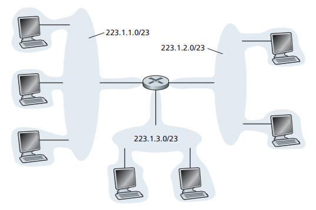
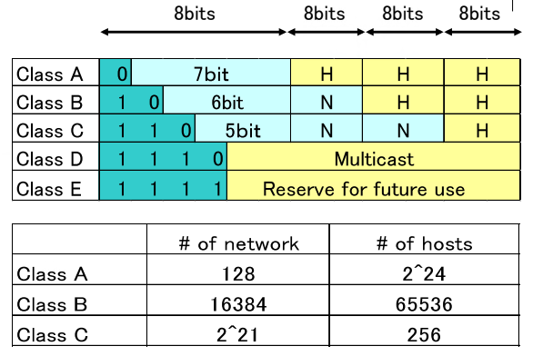
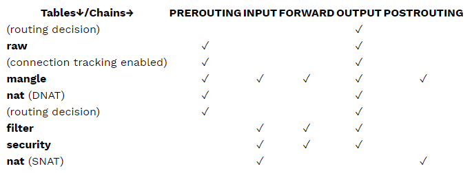

# Network Layer

## 1. Introduction

### 1.1. Forwarding and Routing

- The role of the network layer is to move packets from a sending host to a receiving host. To do so, two important network-layer functions can be defined:
  - Forwarding: when a packet arrives at router's input link, the router must move the packet to the appropriate output link.
  - Routing: the network layer must determine the route or path taken by packets as they flow from a sender to a receiver. The algorithms that calculate these paths are referred to as **routing algorithms**.

- Every router has an forwarding table. A router forwards a packet by examining the value of a field in the arriving packet's header, and then using this header value to index into the router's forward table.

  

  - The value stored in the fowarding table entry for that header indicates the router's outgoing link interface to which that packet is to be forwarded.
  - Depending on the network-layer protocol, the header value could be the destinatio address of the packet or an indication of the connection to which the packet belongs.
- The routing algorithm may be centralized (with an algorithm executing on a central site that downloading routing information to each of the routers) or decentralized (with a piece of the distributed routing algorithm running in each router).
- Packet switch: general packet-switching device that transfers a packet from input link interface to output link interface, according to the value in a field in the hader of the packet.
- Packet switches:
  - Link-layer switches: base their forwarding decision on values in the fields of the link-layer frame -> swithes are referred to as link-layer devices.
  - Routers: base their forwarding decision on the value in the network-layer field -> routers are network-layer devices.

### 1.2. Network service models

- The network service model defines the characteristics of end-to-end transport of packets between sending and receiving end systems.
- Services provided when the transport layer passes a packet to the network layer:
  - Guaranteed delivery: guarantees that the packet will eventually arrive at its destination.
  - Guaranteed delivery with bounded delay: not guarantees delivery of the packet, but delivery within a specified host-to-host delay bound.
- Services provided to a flow of packets between a given source and destination:
  - In-order packet delivery: guarantees that packets arrive at the destination in the order that they were sent.
  - Guaranteed minimal bandwidth: emulates the behavior of a transmission link of a specified bit rate between sending and receiving hosts. As long as the sending host transmits bits (as part of packet) at a rate below the specified bit rate, then no packet is lost and each packet arrives within a prespecified host-to-host delay (eg. 40 msec).
  - Guaranteed maximum jitter: guarantees that the amount of time between the transmission of 2 successive packets at the sender is equal to the amount of time between their receipt at the destination.
  - Security services:
    - Using a secret session key known only by a source and destination host, the network layer in the source host could encrypt the payloads of all datagrams being sent to the destination host.
    - The network layer in the destination host wold be responsible for decrypting the payloads.
    - Provides confidentiality to all transport-layer segments (TCP and UDP) between the source and destination hosts.
    - Provides data integrity and source authentication services.

## 2. Virtual Circuit and Datagram Networks

- A network layer can provide connectionless service or connection service between two hosts.
- Network-layer connection and connectionless services in many ways parallel transport-layer connection-oriented and connectionless services.
- Differences between network-layer connection and connectionless to transport-layer connection-oriented and connectionless services:
  - In the network layer, these services are host-to-host services provided by the network layer for the transport layer. In the transport layer, these services are process-to-process services provided by the transport layer for the application layer.
  - In all major computer network architectures, the network layer provides either a host-to-host connectionless service or a host-to-host connection services, but not both.
    - Computer networks that provide only a connection service at the network layer are called **virtual-circuit (VC) networks**.
    - Computer networks that provide only a connecitonless service at the network layer are called **datagram networks**.
  - The implementations of connection-oriented service in the transport layer and the connection service in the network layer are fundamentally different.
    - The transport-layer connection-oriented service is implemented at the edge of the network in the end systems.
    - The networ-layer connection service is implemented in the routers in the network core as well as in the end systems.

### 2.1. Virtual-Circuit Networks

- A VC consists of:
  - A path (a series of links and routers) between the source and destination hosts.
  - VC numbers, one number for each link along the path.
  - Entries in the forwarding table in each router along the path.
    - A packet belonging to a virtual circuit will carry a number in its header.
    - A VC may have different VC number on each link -> each interventing router must replace the VC number of each traversing packet with a new VC number.
    - The new VC number is obtained from the forwarding table.
- In a VC network, the network's routers must maintain connection state information for the ongoing connections.
- Each time a new connection is established across a router, a new connection entry must be added to the router's forwarding table; and each time a connection is released, an entry must be removed from the table.
  
  

- Three phases in a VC:
  - VC setup:
    - The sending transport layer contacts the network layer, specifies the receiver's address, and waits for the network to set up the VC.
    - The network layer determines the path between sender and receiver, that is, the series of links and routers through which all packets of the VC will travel.
    - The network layer also determines the VC number for each link along the path.
    - The network layer adds an entry in the forwarding table in each router along the path.
    - During the VC setup, the network layer may also reserve resources (eg. bandwidth) along the path of VC.
  - Data transfer: once the VC has been established, packets can begin to flow along the VC.
  - VC teardown:
    - Initiated when the sender (or receiver) informs the network layer of its desire to terminate the VC.
    - The network layer inform the end system on the other side of the network and update the forwarding tables in each of the packet routers on the path to indicate that the VC no longer exists.
  
  

- Routers along the paht between the two end systems are involved in VC setup, and each router is fully aware of all the VCs passing through it.
- The message that end systems send into the network to initiate or terminate a VC, and the messages passed between the routers to setup the VC (that is, to modify connection state in router tables) are known as **signaling messages**, and the protocols used to exchange these messages are often referred to as **signaling protocols**.

### 2.2. Datagram Networks

- Each time an end system wants to send a packet, it stamps the packet with the address of the destination end system and then pops the packet into the network.
  
  

  - As a packet is transmitted from source to destination, it passes through a series of routers.
  - Each of these routers uses the packet's destination address to forward the packet.
  - Each router has a forwarding table that maps destination addresses to link interfaces; when a packet arrives at the router, the router uses the packet's destination address to look up the appropriate output link interface in the forwarding table.
  - The router intentionally forwards the packet to that output link interface.
- Datagram networks maintain no connection state information, but forwarding state information in their forwarding table.
- However, the time scale at which this forwarding state information changes is relatively slow.
  - In a datagram network, the fowarding tables are modified by the routing algorithms, which typically update a forwarding table every one-to-five minutes or so.

    -> Forwarding tables in datagram networks can be modified at any time -> a series of packets sent from one end system to another may follow different paths through the network and may arrive out of order.

## 3. Router

- Routers are equipments that transfer packets among networks.
  - They are computers with special hardware.
  - Connect multiple sub-networks.
  - Forward packet based on routing table.

- Router components:
  - Input ports: an input port perfoms several key functions.
    - Performs the physical layer function of terminating an incoming physical link at a router (the leftmost box of the input box and the rightmost box of the outpt port).
    - Performs link-layer functions needed to interoperate with the link layer at the other side of the incoming link (middle boxes in the input and output ports).
    - Performs the lookup function (rightmost box of the input port).
    - Forwarding table is consulted to determine the router output port to which an arriving packet will be forwarded via the switching fabric.
    - Control packets (eg. packets carrying routing protocol information) are forwarded from an input port to the routing processor.
  - Switching fabric: connects the router's input ports to its output ports. This switching fabric is completely contained within the router (a network inside of a network router).
  - Output ports:
    - An output port stores packets received from the switching fabric and transmits these packets on the outgoing link by performing the necessary link-layer and physical-layer functions.
    - When a link is bidirectional (carries traffic in both directions), an output port will be paired with the input port for that link on the same line card (a printed circuit board containing one or more input ports, which is connected to the switching fabric).
  - Routing processor:
    - Executes the routing protocols.
    - Maintains routing tables and attached link state information.
    - Computes the forwarding table for the router.
    - Performs the network management functions.
- A router's input ports, output ports, and switching fabric together implement the forwarding function (sometimes referred to as the **router forwarding plane**) and are almost always implemented in hardware.
- The **router control plane** functions are usually implemented in software and execute on the routing processor.

### 3.1. Input Processing

- The lookup performed in the input port is central to the router's operation.
- The forwarding table is computed and updated by the routing processor, with a shadow copy stored at each input port.
- With a shadow copy, forwarding decisions can be made locally, at each input port, without invoking the centralized routing processor on a per-packet basis and thus avoiding a centralized processing bottleneck.
- Lookup is simple, just search through the forwardubg table looking for the longest prefix match.
- Once a packet's output port has been determined via the lookup, the packet can be sent into the switching fabric.

### 3.2. Switching

- Switching can be accomplished in a number of ways:
  - Switching via memory: the simplest, earliest routers were traditional computers, with swiching between input and output ports being done under direct control of the CPU (routing processor).
    - Input and output ports functioned as traditional I/O devices in a traditional operating system.
    - An input port with an arriving packet first signaled the routing processor via an interrupt.
    - The packet was then copied from the input port into processor memory.
    - The routing processor then extracted the destination address from the header, looked up the appropriate output port in the forwarding table, and copied the packet to the output port's buffers.
  
    Note: Two packets cannot be forwarded at the same time, even if they have different destination ports, since only one memory read/write over the shared system bus can be done at a time.
  
  

  - Switching via a bus: an input port transfers a packet directly to the output port over a shared bus, without intervention by the routing processor.
    - The input port pre-pend a switch-internal label (header) to the packet indicating the local ouput port to which this packet is being transferred and transmitting the packet onto the bus.
    - The packet is received by all output ports, but only the port that matches the label will keep the packet.
    - The label is then removed at the output port.
    - If multiple packet arrive to the router at the same time -> must wait since only one packet can cross the bus at a time

    -> The switching speed of the router is limited to the bus speed.

    -> Switching via a bus is often sufficient for routers that operate in small local area and enterprise networks.
  - Switching via an interconnection network: a crossbar switch is an interconnection network consisting of 2N buses that connect N input ports to N output ports.
    - Each vertical bus intersects each horizontal bus at a crosspoint, which can be opened or closed at any time by the switch fabric controller.
    - When a packet arrives from port A and needs to be forwarded to port Y, the switch controller closes the crosspoint at the intersection of busses A and Y, and port A sends the packet onto its bus.
    - Packet from port B can forwarded to port X at the same time, since the A-to-Y and B-to-X packets use different input and output busses.

    -> Crossbar networks are capable of forwarding multiple packets in parallel.

    - If 2 packets from 2 different input ports are destined to the same output port, one will have to wait at the input, since only one packet can be sent over any given bus at a time.

### 3.3. Output Processing

- Output port processing takes packets that have been stored in the output port's memory and transmits them over the output link, includes selecting and de-queueing packets for transmission and performing the needed link-layer and physical-layer transmission functions.

### 3.4. The Routing Control Plane

- The network-wide routing control plane is decentralized - with different pieces (e.g. of a routing algorithm) executing at different routers and interacting by sending control messages to each other.

## 4. The Internet Protocol (IP)

The components of the Internet's network layer:

- The IP protocol.
- The routing component: determines the path a datagram follows from source to destination, computes the forwarding tables that are used to forward packets through the network.
- The Internet Control Message Protocol (ICMP): reports errors in datagrams and respond to requests from certain netwok-layer information.

## 4.1. Datagram Format

IPv4 datagram format is shown in the diagram above:

- Version number: these 4 bits specify the IP protocol version of the datagram (IP, IPv4, IPv6). The router can determine how to interpret the remainder of the IP datagram by looking at the version number.
- Header length: Since an IPv4 datagram can contain a variable number of options, these 4 bts are needed to determine where in the IP datagram the data actually begins. Most IP datagrams do not contain options, so the typical IP datagram has a 20-byte header.
- Type of service: the type of service (TOS) bits were included in the IPv4 header to allow different types of IP datagrams to be distinguished from each other.
- Datagram length: this is the total length of the IP datagram (header + data). Since this field is 16 bits long, the theoretical maximum size of the IP datagram is 65,535 bytes. However, datagrams are rarely larger than 1,500 bytes.
- Idenfifier, loags, fragmentatin offset: these field have to do with IP fragementation. The new IPv6 does not allow for fragmentation at routers.
- Time-to-live: the TTL field is included to ensure that datagrams do not circulate forever in the network. This field is decremented by one each time the datagram is processed by a router. If the TTL field reaches 0, the datagram must be dropped.
- Protocol: this field is used only when an IP datagram reaches its final destination. The value of this field indicates the specific transport-layer protocol to which the data portion of this IP datagram should be passed.
  - For example, a value of 6 indicates that the data porion is passed to TCP, while a value of 17 indicates that data is passed to UDP.
  - The protocol number in the IP datagram has a role that is similar to the role of the port number field in the transport-layer segment.
  - The protocol number is the glue that binds the network and transport layers together.
- Header checksum: the header checksum helps a router in detecting bit errors in a received IP datagram.
  - A router computes the header checksum for each received IP datagram and detects an error condition if the chacksum carried in the datagram header does not equal the computed checksum.
  - Routers typically discard datagrams for which an error has been decteced.
  - TCP/IP perform error checking at both the transport and network layers for serveral reasons:
    - Only the IP header is checksummed at the IP layer, while the TCP/UDP checksum is computed over the entire TCP/UDP segment.
    - TCP/UDP and IP do not neccessarily both have to belong to the same protocol stack.
- Source and destination IP addresses: when a source creates a datagram, it inserts its IP address into the source Ip address field and inserts the address of the destination into the destination IP address field. Often the source host determines the destination addres via a DNS lookup.
- Options: the options fields allow an IP header to be extended. Header options were rarely used in order to save overhead in every datagram header.
- Data (payload): the data field of the IP datagram contains the transport-layer segment (TCP or UDP) to be delivered to the destination. However, the data field can carry other types of data, such as ICPM messages.

## 4.2. IPv4

- A host has only a single link into the network; when IP in the host wants to send a datagram, it does so over this link.
- The boundary between the host and the physical link is called an interface.
- A router has 2 or more links to connect, since it need one link for receive a datagram and some other link to forward the datagram.
- The boundary between router and any one of its links is also called an interface.
- Because every host and router is capable of sending and receiving IP datagrams, IP requires each host and router interface to have its own IP address.

  -> An IP address is technically associated with an interface, rather than with the host or router containing that interface.

- Each IP address is 32 bits (4 bytes) long -> there are a total of 2^32 possible IP addresses.
- These addresses are written in **dotted-decimal notation**, in which each byte of the address is written in its decimal form and is separated by a period (dot). For example: 193.32.216.9 and the address in binary notation is 11000001 00100000 11011000 00001001.
- IP address is globally unique.
- A portion of an interface's IP address will be determined by the subnet to which it is connected.
  
  

- In the figure above, the network interconnecting three host interfaces and ont router interface forms a **subnet** (a subnet is also called an *IP network* or simply a *network*).
- IP addressing assigns an address to this subnet: 223.1.1.0/24, where /24 anotation, sometimes known as a **subnet mask**, indicates that the leftmost 24 bits of the 32-bit quantity define the subnet address.
- Any addition hosts attached to the 223.1.1.0/24 subnet would be required to have an address of the form 223.1.1.xxx.
- The Internet's address assignment strategy is known as **Classless Interdomain Routing (CIDR)**.
- CIDR generalizes the notion of subnet addressing. As with subnet addressing, the 32-bit IP address is divided into two parts and again has the dotted-decimal form *a.b.c.d/x*, where *x* indicates the number of bits in the first part of the address.
  - The x most significant bits of an address indicate the netwrok portion of the IP address, and are often referred to as the **prefix** (or network prefix) of the address.
  - An organization is assigned a block of contiguous addresses (a range of addresses with a common prefix). The IP addresses of devices within the organization will share the common prefix. When a router outside the organization forwards a datagram whose destination address is inside the organization, only the leading x bits of the address need to be considered.

    -> Reduce size of the forwarding table in these routers.

  - The remaining 32 - x bits of an address can be thought of as distinguishing among the devices within the organization, all of which have the same network prefix.

- **Classful addressing**: the network portions of an IP address were contrained to be 8, 16 or 24 bits in length, subnets with 8-, 16- and 24- bit subnet addresses were known as class A, B and C networks.

  

  -> Problem: a class C (/24) subnet could accommodate only upto 256 hosts - too small for many organizations. However, a class B (/16) subnet supports upto 65634 hosts - too large. -> wasteful.

## 4.3. Internet Control Message Protocol (ICMP)

- ICMP is used by hosts and routers to communicate network-layer information to each other. The most use of ICMP is for error reporting.
- ICMP is often considered part of IP but architectureally it lies just above IP, as ICMP messages are carried inside IP datagrams (ICMP messages are carried as IP payload). Similarly, when a host recives an IP datagram with ICMP specified as the upper-layer protocol, it demultiplexes the datagram's contents to ICMP, just as it would demultiplex a datagram's content to TCP or UDP.
- ICMP messages have a type and a code field, and contain the header and the first 8 bytes of the IP datagram that caused the error.

  ICMP Type | Code | Description
  --- | --- | ---
  0 | 0 | echo reply (to ping)
  3 | 0 | destination network unreachable
  3 | 1 | destination host unreachable
  3 | 2 | destination protocol unreachable
  3 | 3 | destination port unreachable
  3 | 6 | destination network unknown
  3 | 7 | destination host unknown
  4 | 0 | source quench (congestion control)
  8 | 0 | echo request
  9 | 0 | router advertisement
  10 | 0 | router discovery
  11 | 0 | TTL expired
  12 | 0 | IP header bad

- Traceroute: allows to trace a route from a host to any other host in the world. Traceroute is implemented with ICMP messages.
- Traceroute in the source sends a series of ordinary IP datagrams to the destination. Each of these datagrams carries a UDP segment with an unlikely UDP port number.
  - The first of these datagrams has a TTL of 1, the second of 2, and so on.
  - The source starts timers for each of the datagram.
  - When the *n*th datagram arrives at the *n*th router, the *n*th router observes that the TTL of the datagram has just expired, the router discards the datagram and sends an ICMP warning message to the source (type 11 code 0).
  - This warning message includes the name of the router and its IP address.
  - When this ICMP message arrives back at the source, the source obtains the RTT from the timmer and the name and IP address of the *n*th router from the ICMP message.
- One packet eventually arrives at the destination host. Since this datagram contains a UDP segment with an unlikely port number, the destination host sends a port unreachable ICMP message (type 3 code 3) back to the source.
  - When the source host receives this particular ICMP message, it knows it does not need to send additional probe packets. (The standart Traceroute program actually sends sets of 3 packets with the same TTL; thus the Traceroute output provides 3 resuls for each TTL).

    -> The source host learns the number and the identities of routers that lie between it and the destination host and RTT between the 2 hosts.

## 5. IPTables and Netfilter

- The basic firewall software most commonly used in Linux is called iptables.
- The iptables firewall works by interacting with the packet filtering hooks in the Linux kernel's networking stack. These kernel hooks are known as the netfilter framework.
- Every packet that enters networking system (incoming or outgoing) will trigger these hooks.

### 5.1. Netfilter hooks

- As packets progress through the stack, they will trigger the kernel modules that have registered with these hooks. The hook that a packet will trigger depends on whether the packet is incoming or outgoing, the packet's destination, and whether the packet was dropped or rejected at a previous point.
- There are five netfilter hooks:
  - `NF_IP_PRE_ROUTING`: this hook will be triggered by any incoming traffic very soon after entering the network stack. This hook is processed before any routing decisions have been made regarding where to send the packet.
  - `NF_IP_LOCAL_IN`: this hook is triggered after an incoming packet has been routed if the packet is destined for the local system.
  - `NF_IP_FORWARD`: this hook is triggered after an incoming pakcet has been routed if the packet is to be forwarded to another host.
  - `NF_IP_LOCAL_OUT`: this hook is triggered by any locally created outbound traffic as soon as it hits the network stack.
  - `NF_IP_POST_ROUTING`: this hook is triggered by any outgoing or forwarded traffic after routing has taken place and just before being put out on the wire.
- Kernel modules that wish to register at these hooks must provide a priority number to help determine the order in which they will be caled when the hook is triggered.
- Each module will be called in turn and will return a decision to netfilter after processing that indicates what should be done with the packet.

### 5.2. IPTables

- The iptables firewall uses tables to organze its rules. These tables classify rules according to the type of decisions they are used to make. For example, if a rule deals with network address translation, it will be put into the *nat* table. If the rule is used to decide whether to allow the packet to continue to its destination, it would be added to the *filter* table.
- Within each iptables table, rules are organized within separate *chains*.
- The built-in chains represent the netfilter hooks which trigger them (the chains basically determine when the rules will be evaluated).
- The name of the built-in chains mirror the names of the netfilter hooks they are associated with:
  - `PREROUTING`: triggered by the `NF_IP_PRE_ROUTING` hook.
  - `INPUT`: triggered by the `NF_IP_LOCAL_IN` hook.
  - `FORWARD`: triggered by the `NF_IP_FORWARD` hook.
  - `OUTPUT`: triggered by the `NF_IP_LOCAL_OUT` hook.
  - `POSTROUTING`: triggered by the `NF_IP_POST_ROUTING` hook.
- There are only 5 netfilter kernel hooks, so chains from multiple tables are registered at each of the hooks.
  - For example, 3 tables have PREROUTING chains. When these chains register at the associated NF_IP_PRE_ROUTING hook, they specify a priority that dictates what order each table's PREROUTING chain is called.
  - Each of the rules inside the highest priority PREROUTING chain is evaluated sequentially before moving onto the next PREROUTING chain.

#### 5.2.1. IPTables tables

- The filter table:
  - The filter table is one of the most widely used tables in iptables. 
  - The filter table is used to make decisions about whether to let a packet continue to its intended destination or to deny its request (filtering packets).
- The NAT table:
  - The nat table is used to implement network address translation rules.
  - As packets enter the network stack, rules in this table will determine whether and how to modify the packet's source or destination addresses in order to impact the way that the packet and any response traffic are routed.
  - This is often used to route packets to networks when direct access is not possible.
- The mangle table:
  - The mangle table is used to alter the IP headers of the packet in various ways, such as changing TTL values.
  - This table can also place an internal kernel mark on the packet for further processing in other tables and by other networking tools. This mark does not touch the actual packet, but adds the mark to the kernel's representation of the packet.
- The raw table:
  - The iptables firewall is stateful, meaning that packets are evaluated in regards to their relation to previous packets (for example, a packet could be part of a new connection, or it could be part of an existing connection).
  - The raw table allows to work with packets before the kernel starts tracking its state.
- The security table:
  - The security table is used to set internal SELinux security context marks on packets, which will affect how SELinux or other systems that can interpret SELinux security contexts handle the packets.
  - These marks can be applied on a per-packet or per-connection basis.

#### 5.2.2. IPTables Chains

- The chains that available within each iptables table:
  
  

  - The nat table has been split between DNAT operations (alter the destination adderss of a packet) and SNAT operations (alter the source address).

- Chain traversal order:
  - Incoming packets destined for the local system: PREROUTING -> INPUT
  - Incoming packets destined to another host: PREROUTING -> FORWARD -> POSTROUTING
  - Locally generated packets: OUTPUT -> POSTROUTING
  
#### 5.2.3. IPTables Rules

- Rules are placed within a specific chain of a specific table.
- Each rule has a matching component and an action component.
- Matching:
  - The matching portion of a rule specifies the criteria that a packet must meet in order for the associated action to be executed.
  - The matching system is flexible and can be expanded with iptables extensions available on the system.
  - Rules can be contructed to match by protocol type, destination or source address, destination or source port, destination or source network, input or output interface, headers, or connection state among other criteria. These can be combined to create fairly complex rule sets to distinguish between different traffic.
- Targets:
  - A target is the action that are triggered when a packet meets the matching criteria of a rule.
  - Target are divided into 2 categories:
    - Terminating targets: perform an action which terminates evaluation within the chain and returns control to the netfilter hook. Depending on the return value provided, the hook might drop the packet or allow the packet to continue to the next stage of processing.
    - Non-terminating targets: perform an action and continue evaluation within the chain. Although each chain must eventually pass back a final terminating decision, any number of non-terminating targets can be executed beforehand.

#### 5.2.4. Connection Tracking

- Connection tracking allows iptables to make decisions about packets viewed in the context of an ongoing connection.
- The connection tracking system provides iptables with the functionality it needs to perform "stateful" operations.
- Connection tracking is applied very soon after packets enter the network stack.
- The system checks each packet against a set of existing connections. It will update the state of the connection in its store if needed and will add new connections to the system when neccessary.
- Packets that have been marked with the NOTRACK target in one of the raw chains will bypass the connection tracking routines.
- Available states:
  - NEW: When a packet arrives that is not associated with an existing connection, but is not invalid as a first packet, a new connection will be added to the system with this label.
  - ESTABLISHED: a connection is changed from NEW to ESTABLISHED when it receives a valid response in the opposite direction. For TCP connections, this means a SYN/ACK and for UDP and ICMP traffic, this means a response where source and destination of the original packet are switched.
  - RELATED: pakcets that are not part of an existing connection, but are associated with a connection already in the system are labeled RELATED.
  - INVALID: packets can be marked INVALID if they are not associated with an existing connection and aren't appropriate for opening a new connection, if they cannot be identified, or if they aren;t routable among other reasons.
  - UNTRACKED: packets can be marked as UNTRACKED if they've been targeted in a raw table chain to bypass tracking.
  - SNAT: a virtual state set when the source address has been altered by NAT operations. This is used by the connection tracking system so that is knows to change the source addresses back in reply packets.
  - DNAT: a virtual state set when the destination address has been altered by NAT operations. This is used by the connection tracking system so that it knows to change the destination address back in reply packets.