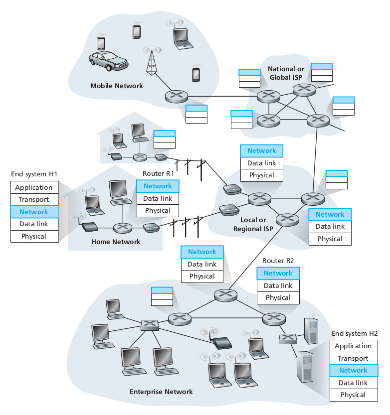
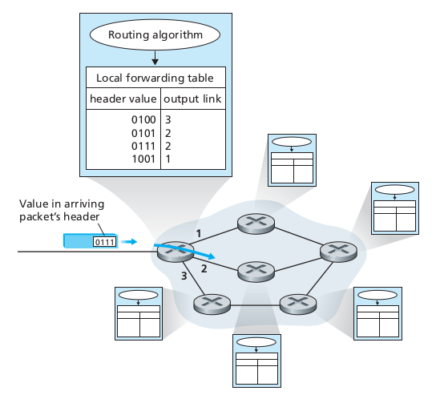
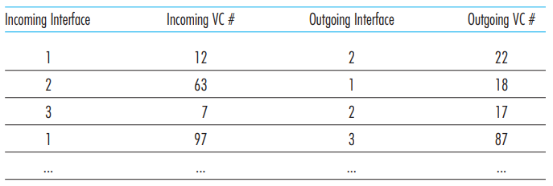
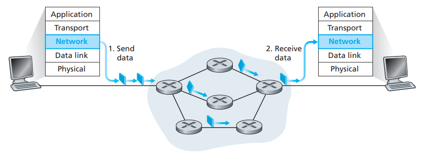
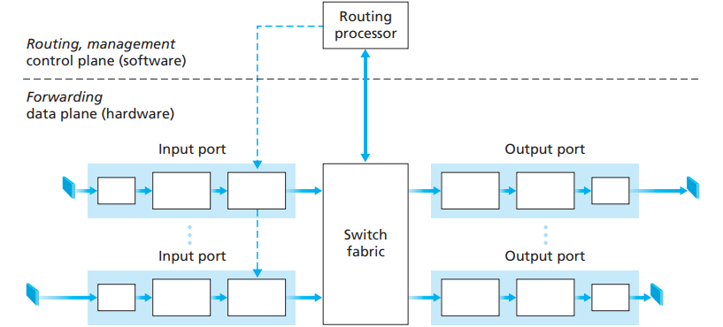
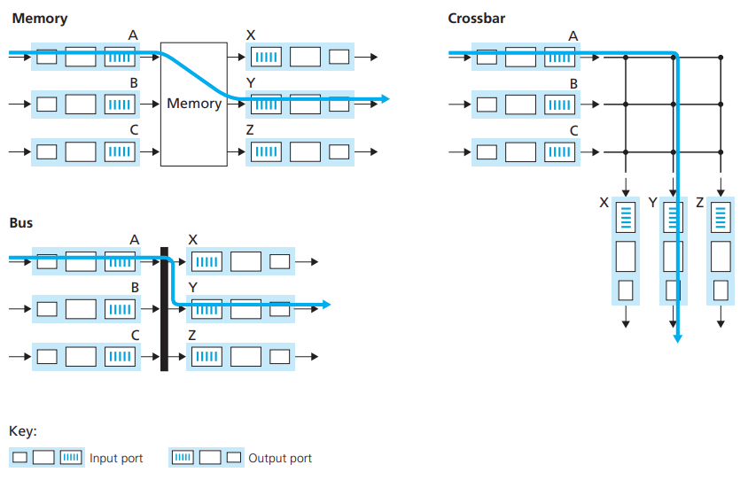

# Network Layer

## 1. Introduction

### 1.1. Forwarding and Routing

- The role of the network layer is to move packets from a sending host to a receiving host. To do so, two important network-layer functions can be defined:
  - Forwarding: when a packet arrives at router's input link, the router must move the packet to the appropriate output link.
  - Routing: the network layer must determine the route or path taken by packets as they flow from a sender to a receiver. The algorithms that calculate these paths are referred to as **routing algorithms**.

- Every router has an forwarding table. A router forwards a packet by examining the value of a field in the arriving packet's header, and then using this header value to index into the router's forward table.

  

  - The value stored in the fowarding table entry for that header indicates the router's outgoing link interface to which that packet is to be forwarded.
  - Depending on the network-layer protocol, the header value could be the destinatio address of the packet or an indication of the connection to which the packet belongs.
- The routing algorithm may be centralized (with an algorithm executing on a central site that downloading routing information to each of the routers) or decentralized (with a piece of the distributed routing algorithm running in each router).
- Packet switch: general packet-switching device that transfers a packet from input link interface to output link interface, according to the value in a field in the hader of the packet.
- Packet switches:
  - Link-layer switches: base their forwarding decision on values in the fields of the link-layer frame -> swithes are referred to as link-layer devices.
  - Routers: base their forwarding decision on the value in the network-layer field -> routers are network-layer devices.

### 1.2. Network service models

- The network service model defines the characteristics of end-to-end transport of packets between sending and receiving end systems.
- Services provided when the transport layer passes a packet to the network layer:
  - Guaranteed delivery: guarantees that the packet will eventually arrive at its destination.
  - Guaranteed delivery with bounded delay: not guarantees delivery of the packet, but delivery within a specified host-to-host delay bound.
- Services provided to a flow of packets between a given source and destination:
  - In-order packet delivery: guarantees that packets arrive at the destination in the order that they were sent.
  - Guaranteed minimal bandwidth: emulates the behavior of a transmission link of a specified bit rate between sending and receiving hosts. As long as the sending host transmits bits (as part of packet) at a rate below the specified bit rate, then no packet is lost and each packet arrives within a prespecified host-to-host delay (eg. 40 msec).
  - Guaranteed maximum jitter: guarantees that the amount of time between the transmission of 2 successive packets at the sender is equal to the amount of time between their receipt at the destination.
  - Security services:
    - Using a secret session key known only by a source and destination host, the network layer in the source host could encrypt the payloads of all datagrams being sent to the destination host.
    - The network layer in the destination host wold be responsible for decrypting the payloads.
    - Provides confidentiality to all transport-layer segments (TCP and UDP) between the source and destination hosts.
    - Provides data integrity and source authentication services.

## 2. Virtual Circuit and Datagram Networks

- A network layer can provide connectionless service or connection service between two hosts.
- Network-layer connection and connectionless services in many ways parallel transport-layer connection-oriented and connectionless services.
- Differences between network-layer connection and connectionless to transport-layer connection-oriented and connectionless services:
  - In the network layer, these services are host-to-host services provided by the network layer for the transport layer. In the transport layer, these services are process-to-process services provided by the transport layer for the application layer.
  - In all major computer network architectures, the network layer provides either a host-to-host connectionless service or a host-to-host connection services, but not both.
    - Computer networks that provide only a connection service at the network layer are called **virtual-circuit (VC) networks**.
    - Computer networks that provide only a connecitonless service at the network layer are called **datagram networks**.
  - The implementations of connection-oriented service in the transport layer and the connection service in the network layer are fundamentally different.
    - The transport-layer connection-oriented service is implemented at the edge of the network in the end systems.
    - The networ-layer connection service is implemented in the routers in the network core as well as in the end systems.

### 2.1. Virtual-Circuit Networks

- A VC consists of:
  - A path (a series of links and routers) between the source and destination hosts.
  - VC numbers, one number for each link along the path.
  - Entries in the forwarding table in each router along the path.
    - A packet belonging to a virtual circuit will carry a number in its header.
    - A VC may have different VC number on each link -> each interventing router must replace the VC number of each traversing packet with a new VC number.
    - The new VC number is obtained from the forwarding table.
- In a VC network, the network's routers must maintain connection state information for the ongoing connections.
- Each time a new connection is established across a router, a new connection entry must be added to the router's forwarding table; and each time a connection is released, an entry must be removed from the table.
  
  

- Three phases in a VC:
  - VC setup:
    - The sending transport layer contacts the network layer, specifies the receiver's address, and waits for the network to set up the VC.
    - The network layer determines the path between sender and receiver, that is, the series of links and routers through which all packets of the VC will travel.
    - The network layer also determines the VC number for each link along the path.
    - The network layer adds an entry in the forwarding table in each router along the path.
    - During the VC setup, the network layer may also reserve resources (eg. bandwidth) along the path of VC.
  - Data transfer: once the VC has been established, packets can begin to flow along the VC.
  - VC teardown:
    - Initiated when the sender (or receiver) informs the network layer of its desire to terminate the VC.
    - The network layer inform the end system on the other side of the network and update the forwarding tables in each of the packet routers on the path to indicate that the VC no longer exists.
  
  

- Routers along the paht between the two end systems are involved in VC setup, and each router is fully aware of all the VCs passing through it.
- The message that end systems send into the network to initiate or terminate a VC, and the messages passed between the routers to setup the VC (that is, to modify connection state in router tables) are known as **signaling messages**, and the protocols used to exchange these messages are often referred to as **signaling protocols**.

### 2.2. Datagram Networks

- Each time an end system wants to send a packet, it stamps the packet with the address of the destination end system and then pops the packet into the network.
  
  

  - As a packet is transmitted from source to destination, it passes through a series of routers.
  - Each of these routers uses the packet's destination address to forward the packet.
  - Each router has a forwarding table that maps destination addresses to link interfaces; when a packet arrives at the router, the router uses the packet's destination address to look up the appropriate output link interface in the forwarding table.
  - The router intentionally forwards the packet to that output link interface.
- Datagram networks maintain no connection state information, but forwarding state information in their forwarding table.
- However, the time scale at which this forwarding state information changes is relatively slow.
  - In a datagram network, the fowarding tables are modified by the routing algorithms, which typically update a forwarding table every one-to-five minutes or so.

    -> Forwarding tables in datagram networks can be modified at any time -> a series of packets sent from one end system to another may follow different paths through the network and may arrive out of order.

## 3. Router

- Routers are equipments that transfer packets among networks.
  - They are computers with special hardware.
  - Connect multiple sub-networks.
  - Forward packet based on routing table.

- Router components:
  - Input ports: an input port perfoms several key functions.
    - Performs the physical layer function of terminating an incoming physical link at a router (the leftmost box of the input box and the rightmost box of the outpt port).
    - Performs link-layer functions needed to interoperate with the link layer at the other side of the incoming link (middle boxes in the input and output ports).
    - Performs the lookup function (rightmost box of the input port).
    - Forwarding table is consulted to determine the router output port to which an arriving packet will be forwarded via the switching fabric.
    - Control packets (eg. packets carrying routing protocol information) are forwarded from an input port to the routing processor.
  - Switching fabric: connects the router's input ports to its output ports. This switching fabric is completely contained within the router (a network inside of a network router).
  - Output ports:
    - An output port stores packets received from the switching fabric and transmits these packets on the outgoing link by performing the necessary link-layer and physical-layer functions.
    - When a link is bidirectional (carries traffic in both directions), an output port will be paired with the input port for that link on the same line card (a printed circuit board containing one or more input ports, which is connected to the switching fabric).
  - Routing processor:
    - Executes the routing protocols.
    - Maintains routing tables and attached link state information.
    - Computes the forwarding table for the router.
    - Performs the network management functions.
- A router's input ports, output ports, and switching fabric together implement the forwarding function (sometimes referred to as the **router forwarding plane**) and are almost always implemented in hardware.
- The **router control plane** functions are usually implemented in software and execute on the routing processor.

### 3.1. Input Processing

- The lookup performed in the input port is central to the router's operation.
- The forwarding table is computed and updated by the routing processor, with a shadow copy stored at each input port.
- With a shadow copy, forwarding decisions can be made locally, at each input port, without invoking the centralized routing processor on a per-packet basis and thus avoiding a centralized processing bottleneck.
- Lookup is simple, just search through the forwardubg table looking for the longest prefix match.
- Once a packet's output port has been determined via the lookup, the packet can be sent into the switching fabric.

### 3.2. Switching

- Switching can be accomplished in a number of ways:
  - Switching via memory: the simplest, earliest routers were traditional computers, with swiching between input and output ports being done under direct control of the CPU (routing processor).
    - Input and output ports functioned as traditional I/O devices in a traditional operating system.
    - An input port with an arriving packet first signaled the routing processor via an interrupt.
    - The packet was then copied from the input port into processor memory.
    - The routing processor then extracted the destination address from the header, looked up the appropriate output port in the forwarding table, and copied the packet to the output port's buffers.
  
    Note: Two packets cannot be forwarded at the same time, even if they have different destination ports, since only one memory read/write over the shared system bus can be done at a time.
  
  

  - Switching via a bus: an input port transfers a packet directly to the output port over a shared bus, without intervention by the routing processor.
    - The input port pre-pend a switch-internal label (header) to the packet indicating the local ouput port to which this packet is being transferred and transmitting the packet onto the bus.
    - The packet is received by all output ports, but only the port that matches the label will keep the packet.
    - The label is then removed at the output port.
    - If multiple packet arrive to the router at the same time -> must wait since only one packet can cross the bus at a time

    -> The switching speed of the router is limited to the bus speed.

    -> Switching via a bus is often sufficient for routers that operate in small local area and enterprise networks.
  - Switching via an interconnection network: a crossbar switch is an interconnection network consisting of 2N buses that connect N input ports to N output ports.
    - Each vertical bus intersects each horizontal bus at a crosspoint, which can be opened or closed at any time by the switch fabric controller.
    - When a packet arrives from port A and needs to be forwarded to port Y, the switch controller closes the crosspoint at the intersection of busses A and Y, and port A sends the packet onto its bus.
    - Packet from port B can forwarded to port X at the same time, since the A-to-Y and B-to-X packets use different input and output busses.

    -> Crossbar networks are capable of forwarding multiple packets in parallel.

    - If 2 packets from 2 different input ports are destined to the same output port, one will have to wait at the input, since only one packet can be sent over any given bus at a time.

### 3.3. Output Processing

- Output port processing takes packets that have been stored in the output port's memory and transmits them over the output link, includes selecting and de-queueing packets for transmission and performing the needed link-layer and physical-layer transmission functions.

### 3.5. The Routing Control Plane

- The network-wide routing control plane is decentralized - with different pieces (e.g. of a routing algorithm) executing at different routers and interacting by sending control messages to each other.