# Transport Layer

## 1. Overview

- A transport-layer protocol provides for logical communication between application processes running on different hosts.
- Application processes use the logical communication provided by the transport layer to send messages to each other.
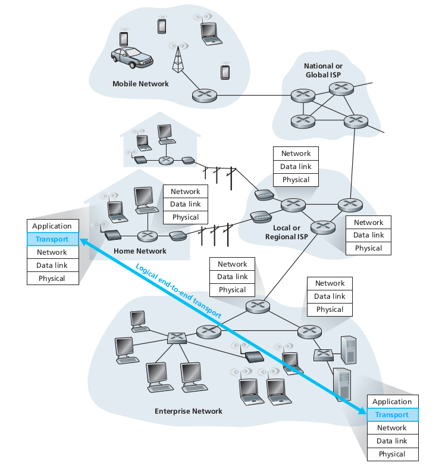
- Transport-layer protocols are implemented in the end systems but not in network routers.
- On sending side:
  - Receives the application-layer messages from a sending application process.
  - Converts the messages into transport-layer packets (segments). If it is too large, the message is broken into small chunks and added a transport-layer header to each chunk and put into several segments.
  - Passes the segment to the network layer at the sending end system, where the segment is encapsulated within a network-layer packet (a datagram) and sent to the destination.
- On receiving side:
  - The network layer extracts the transport-layer segment from the datagram and passes the segment up to the transport layer.
  - The transport layer process the received segment, making the data in the segment available to the receiving application.

### 1.1. Relationship between transport and network layers

- Whereas a transport-layer protocol provides logical communication between *processes* running on different hosts, a network-layer protocol provides logical communication between *hosts*.
- The servies that a transport protocol can provide are often contrained by the service model of the underlying network-layer protocol.
  - If the network-layer protocol cannot provide delay or bandwidth guarantees for transport-layer segments sent between hosts, then the transport-layer protocol cannot provide delay or bandwidth guarantees for application messages sent between processes.
- However, certain services can be offered by a transport protocol even when the unerlying network protocol doesn't offer the corresponding service at the network-layer.
  - For exapmle, a transport protocol can offer reliable data transfer service to an application even when the underlaying network protocol is unreliable.

### 1.2. Overview of the Transport Layer in the Internet

- 2 distinct transport-layer protocols:
  - UDP (User Datagram Protocol): unreliable, connectionless service.
  - TCP (Transmission Control Protocol): reliable, connection-oriented service.
- Why there are 2 kind of services?
  - Various requirement about services from applications.
  - Applications that need 100% reliable data transfer, e.g. FPT, Mail... -> use TCP as transport services.
  - Application that need fast data transfer but can tolerate with packet lost, e.g. VoIP, Video Streaming... -> use UDP as transport services.
  
- Example:
  
  Application | Application layer protocol | Userlying transport protocol
  --- | --- | ---
  Email | SMTP | TCP
  Remote terminal access | Telnet | TCP
  Web | HTTP | TCP
  File transfer | FTP | TCP
  Streaming multimedia | Proprietary (e.g. RealNetworks) | UDP or TCP
  Internet telephony | Proprietary (e.g. Vonage, Diapad) | UDP

## 2. Multiplexing and Demultiplexing

- Transport-layer multiplexing and demultiplexing is extending the host-to-host delivery service provided by the network layer to a process-to-process delivery service for applications running on the hosts.
- Muliplexing: gathering data chunks at the source host from different sockets, encapsulating each data chink with header information to create segments, and passing the segments to the network layer.
- Demultiplexing: examines fields in header information of the segments to identify the receiving socket and then directs the segment to that socket.

  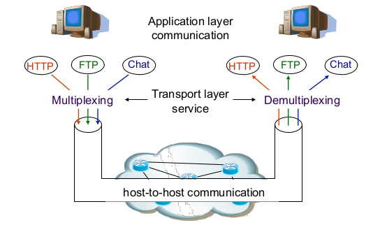

- Transport-layer multiplexing requires that sockets have unique identifiers, and that each segment have special fields that indicate the socket to which the segment is to be delivered.
  
  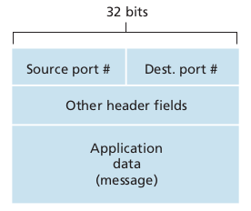

  - Port numbers:
    - 16-bit number, ranging from 0 - 65535.
    - The port numbers ranging from 0 - 1023 are called well-known port numbers and are restricted -> they are reserved for use by well-known application protocols such as HTTP (port 80), FTP (port 21)...
    - When develop a new application, a port number must be assigned to the application.
- Each socket in the host could be assigned a port number, and when a segment arrives at the host, the transport layer examines the destination port number in the segment and directs the segment to the corresponding socket.

## 3. Connectionless Tranport: UDP

- UDP takes messages from the application process, attaches source and destination port number fields for the multiplexing/demultiplexing service, add two other small fields, and passes the resulting segment to the network layer.
- The network layer encapsulates the transport-layer segment into an IP datagram and then makes a bets-effort attempt to deliver the segment to the receiving host.
- If the segment arrives at the receiving host, UDP uses the destination port number to deliver the segment's data to the correct application process.
- UDP has no handshaking between sending and receiving transport-layer entites before sending a segment.

-> UDP is said to be *connectionless*.

- UDP benefits in many applications:
  - Finer application-level control over what data is sent, and when: as soon as an application process passes data to UDP, UDP will package the data inside a UDP segment and immediately pass the segment to the network layer. Since real-time applications often require a minimum sending rate, do not want to overly delay segment transmission, and can tolerate some data loss, these applications prefer UDP rather than TCP.
  - No connection establishment: blasts away data as fast as desired -> does not introduce any delay to establish a connection.
  - No connection state: UDP does not maintain connection state and does not track any of parameters: congestion-control parameters, sequence and acknowledgment number parameters... -> a server can support many more active clients when the application runs over UDP rather than TCP.
  - Small packet header overhead: the TCP segment has 20 bytes of header overhead in every segment, whereas UDP has only 8 bytes of overhead.

### 3.1. UDP Checksum

- The UDP checksum provides for error detection.
- The checksum is used to determine whether bits within the UDP segment has been altered (for example, by noise in the links or while stored in a router) as it moved from source to destination.
- UDP at the sender side performs the 1s complement of the sum of all the 16-bit words in the segment, with any overflow cncounterd during the sum being wrapped around.This result is put in the checksum field of the UDP segment.
- Example:
  - We have the following three 16-bit words:

      ```text
        0110011001100000
        0101010101010101
        1000111100001100
      ```

  - The sum of first 2 of these 16-bit words is:
  
      ```text
        0110011001100000
      + 0101010101010101
      = 1011101110110101
      ```

  - Adding the third word to the above sum gives:

      ```text
          1011101110110101
        + 1000111100001100
      = 1 0100101011000001 -> wrap-around
      = 0100101011000010 <- sum
      ```
  
  - The 1s complement is obtained by converting all the 0s to 1s and converting all the 1s to 0s -> the 1s complement of sum = 0100101011000010 is 1011010100111101, which becomes the checksum.
  - At the receiver, all four 16-bit words are added, including the checksum.
  - If no errors are introduced into the packet, the sum at the receiver will be 1111111111111111.
  - If one of the bits is a 0, then the errors have been introduced to the packet.
- Although UDP provides error checking, it does not do anything to recover from an error.
- Some implementations of UDP simply discard the damaged segment; others pass the damaged segment to the application with a warning.

### 3.2. UDP Segment structure

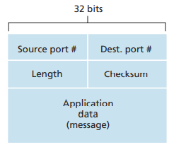

- The UDP header has only 4 fields, each consisting of 2 bytes.
- The port numbers allow the destination host to pass the application data to the correct process running on the destination end system.
- The length field specifies the number of bytes in the UDP segment (header + data).
- The checksum is used by receiving host to check whether errors have been introduced into the segment.

## 4. Connection-Oriented Transport: TCP

### 4.1. The TCP Connection

- TCP is said to be connection-oriented because befor one application process can begin to send data to another, the two processes must first "handshake" with each other - that is, they must send some preliminary segment to each other to establish the parameters of the ensuing data transfer.
- As part of TCP connection establishment, both sides of the connection will initialize may TCP state variables associated with the TCP connection.
- TCP protocol runs only in the end systems and not in the intermediate network elements (routers and link-layer switches).
- A TCP connection provides a **full-duplex service**: If there is a TCP connection between process A on one host and process B on another host, then application-layer data can flow form process A to process B at the same time as application-layer data flows from process B to process A.
- A TCP connection is also always **point-to-point**: between a single sender and a single receiver.
- Multicasting, the transfer of data from one sender to may receivers in a single send operation, is not possible with TCP.
- With TCP, two hosts are company and three are a crowd!
- Establish TCP connection:
  - The client application process informs the client transport layer that it wants to establish a connection to a process in the server.
  - TCP in the client proceeds to establish a TCP connection with TCP in the server.
  - The client first sends a special TCP segment; the server responds with a second special TCP segment; and finally the client responds again with a third special segment.
  - The first 2 segments carry no payload (no application-layer data); the third segment may carry a payload.

  -> Three-way handshake.

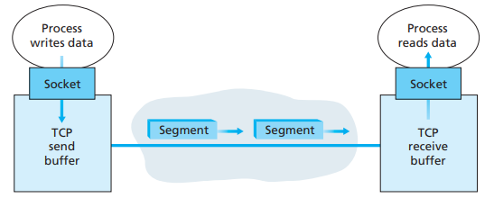

- Once a TCP connection is established, the two application process can send data to each other.
- TCP pairs each chunk of client data with a TCP header, thereby forming TCP segments.
  - The segments are passed down to the network layer, where they are separately encapsulated within network-layer IP datagrams.
  - The datagrams are then sent into the network.
  - When TCP receives a segment at the other end, the segment's data is placed in the TCP connection's receive buffer.
  - The application reads the stream of data from this buffer.
  - Each side of the connection has its own send and receive buffers.

### 4.2. TCP segment structure

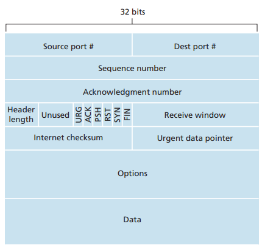

- The TCP segment consists of header fields and a data field.
- The data field contains a chunk of application data.
- The maximum amount of data that can be grabbed and placed in a segment (amount of application-layer data in the segment) is limited by the **maximum segment size (MSS)**. The MSS is typically set by first determining the length of the largest link-layer frame (**maximum transmission unit,MTU**) and then setting the MSS to ensure that a TCP segment + TCP/IP header (typically 40 bytes) will fit into a single link-layer frame.
- When a TCP sends a large file, it typically breaks the file into chunks of size MSS (except for the last chunk, which will often be less than the MSS).
- A TCP segment header contains:
  - The 32-bit sequence number field and the 32-bit acknowledgment number field are used by the TCP sender and receiver in implementing a reliable data transfer service.
  - The 16-bit receive window field is used for flow control.
  - The 4-bit header length field specifies the length of the TCP header in 32-bit word (typically, the options field is empty, so that the lenght of the typical TCP header is 20 bytes).
  - The optional and variable-length options field is used when a sender and receiver negotiate the MSS or as a window scaling factor for use in high-speed network. A time-stamping option is also defined.
  - The flag field contains 6 bits:
    - The ACK bit is used to indicate that the value carried in the acknowledgment field is valid (the segment contains an acknowledgment for a segment that has been successfully received).
    - The RST, SYN, FIN bits are used for connection setup and teardown.
    - Setting the PSH bit indicates that the receiver should pass the data to the upper layer immediately.
    - The URG bit is used to indicate that there is data in this segment that the sending-side upper-layer entity has marked as "urgent". The location of the last byte of this urgent data is indicated by the 16-bit urgent data pointer field.

***Sequence numbers and Acknowledgment numbres***

- TCP views data as an unstructured, but ordered, stream of bytes.
- TCP's use of sequence numbers reflects this view in that sequence numbers are over the stream of transmitted bytes and not over the series of transmitted segments.
- The sequence number for a segment is the byte-stream number of the first byte in the segment.

  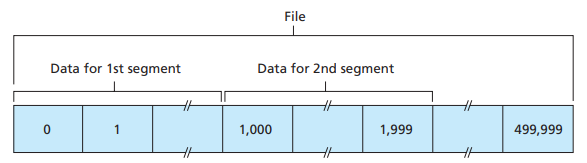

- Example: data stream consists of a file consisting of 500,000 bytes, the MSS is 1,000 bytes, the first byte of the data stream is numbered 0.
  - The TCP constructs 500 segments out of the data stream.
  - The first segment gets assigned sequence number 0, the second segment gets assiged sequence number 1,000, and so on.
  - Each sequence number is inserted in the sequence number field in the header of the appropriate TCP segment.

- The acknowledgement number that one host puts in its segment is the sequence number of the next byte it is expecting from other host.
- Example: Suppose host A has received all bytes numbered 0 - 535 from B and another segment containing bytes 900-1,000. For some reason host A has not yet received bytes 536 - 899.
  -> Host A is still waiting for byte 536 in order to re-create B's data stream. -> A's next segment to B will contain 536 in the acknowledgment number field.
- Because TCP only acknowledges bytes up to the first missing byte in the stream, TCP is said to provide **cumulative acknowledgments**.

### 4.3. Reliable Data Transfer

- TCP creates a reliable data transfer service on top of IP's unreliable best-effort service.
- TCP's reliable data transfer service ensures that the data stream that process reads out of its TCP receive buffer is uncorrupted, without gaps, without duplication, and in sequence.

#### 4.3.1. If channel has bit error, no packet loss

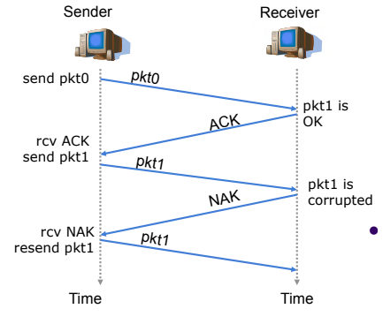

- Three additional protocols to handle the bit error:
  - Error dectection: allows the receiver to detect when bit errors have occurred -> Checksum.
  - Receiver feedback: simply sends positive (ACK - the packet is OK) and (NAK - the packet has error) acknowledgement packets back from the receiver to the sender.
  - Retransmission: a packet that is received in error at the receiver will be retransmitted by the sender.

#### 4.3.2. If channel has bit error and packet loss

- Suppose that the sender transmits a data packet and either that packet, or the receiver's ACK of that packet, gets lost.
- In either case, no reply is forthcoming at the sender from the receiver.
- The sender will wait for a certain time (at least 1 Round-Trip Time (RTT)) and simply retransmit the data packet.
- If the packet reaches the destination, but ACK/NAK is lost, duplication may occurs.
  
  -> Put a sequence number on each packet and receiver discards a duplicated packet.

#### 4.3.3. Pipeline protocols

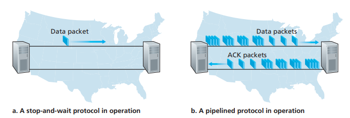

- Rather than operate in a stop-and-wait manner, the sender is allowed to send multiple packets without waiting for acknowledgements.
- Pipelining has following consequences for reliable data transfer protocols:
  - The range of sequence numbers must be increased, since each in-transmit packet must have a sequence number and there may be multiple unacknowledged packets.
  - The sender and receiver sides of the protocols may have to buffer more than one packet. The sender will have to buffer packets that have been transmitted but not yet acknowledged.

### 4.4. Flow control

- When the TCP connecction receives bytes that are correct and in sequence, it places the data in the receive buffer. If the associated application process is relatively slow at reading the data from this buffer, the sender can very easily overflow the connection's receive buffer by sending too much data too quickly.
- TCP provides a flow-control service to its applications to eliminate the possibility of the sender overflowing the receiver's buffer.
- Flow control is a speed-matching service - matching the rate at which the sender is sending against the rate at which the receiving application is reading.
- TCP flow control have a variable called the receive window. The receive window is used to give the sender an idea of how much free buffer space is available at the receiver.
- TCP is full-duplex so that the sender at each side of the connection maintains a distinct receive window.

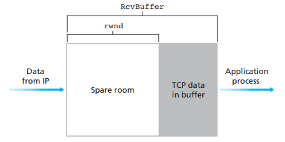

- The application process in receiving side reads from the buffer. Define the following variables:
  - LastByteRead: the number of the last byte in the data stream erad from the buffer by the application process in the receiver.
  - LastByteRcvd: the number of the last byte in the data stream that has arrived from the network and has been placed in the receive buffer at the receiver.
- Since TCP is not permitted to overflow the allocated buffer, we must have:
  
  ```text
  LastByteRcvd – LastByteRead < RcvBuffer
  ```

- The receive window, denoted *rwnd* is set to the amount of spare room in the buffer:
  
  ```text
  rwnd = RcvBuffer – [LastByteRcvd – LastByteRead]
  ```

- The receiver tells the sender how much spare room it has in the connection buffer by placing its current value of rwnd in the receive window file of every segment. Initially, *rwnd* = *RcvBuffer*.
- The sender keeps track of 2 variables *LastByteSent* and *LastByteAcked*. By keeping the amount of unacknowledged data less than the value of *rwnd*, the sender is assured that it is not overflowing the receive buffer at the receiver.
  
  ```text
  LastByteSent – LastByteAcked < rwnd
  ```

### 4.5. Congestion control

- Congestion occurs when there are too many senders and receivers, they send too much data so that the network cannot handle.
- Consequence of congestion:
  - Packet loss.
  - Decrease of throughput and increase of delay.
  
  -> Everything gets worse.

- TCP uses a congestion window and a congestion policy that avoid congestion.
- Congestion policy in TCP:
  - Slow start phase: starts slowly increment is exponential to threshold.
  - Congestion avoidance phase: gradually increasing the rate to avoid congestion.
  - Congestion detection phase: sender goes back to slow start phase or congestion avoidance phase.

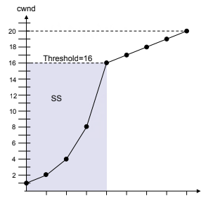

#### 4.5.1. Slow start phase: exponential increment

- Slow start begins with a initial value of *cwnd*, must be 2, 3 or 4 MSS.
- The value for the congestion window size can be increased by 1 MSS with each acknowledgment received.
- The transmission rate will be increased by the slow-start algorithm until either a packet loss is detected, or the receiver's advertised window (rwnd) is the limiting factor, or the slow start threshold (ssthresh) is reached.
- If the *cwnd* reaches *ssthresh*, TCP changes to congestion avoidance algorithm. It should increased by up to 1 MSS for each RTT.

  ```text
  Initially cwnd = 1
  After 1 RTT, cwnd = 2^(1) = 2
  2 RTT, cwnd = 2^(2) = 4
  3 RTT, cwnd = 2^(3) = 8
  ```

#### 4.5.2. Congestion avoidance phase: additive increment

- This phase starts after the *cwnd* reached the threshold value (ssthresh). The size of *cwnd* then increases additively.
- After each RTT, cwnd = cwnd + 1.
  
  ```text
  Initially cwnd = i
  After 1 RTT, cwnd = i+1
  2 RTT, cwnd = i+2
  3 RTT, cwnd = i+3
  ```

#### 4.5.3. Congestion dectection phase: multilicative decrement

- If congestion occurs, the *cwnd* is decreased.
- The only way a sender can guess that congestion has occurred is the need to retransmit a segment.
- Retransmission can occur in one of 2 cases:
  - Retransmission timer timeouts.
  - Three same ACKs are received.

  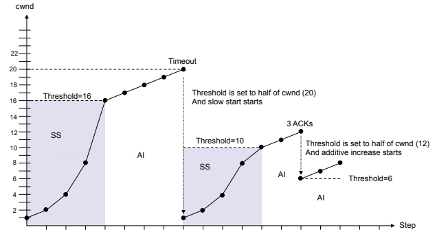

- When retransmission timer timeouts:
  - TCP sets threshold to half of the current *cwnd* size.
  - TCP sets *cwnd* to the size of one MSS (cwnd = 1).
  - TCP starts the slow start phase.
- When same three ACKs are arrived:
  - TCP sets threshold to half of the current *cwnd* size.
  - TCP sets *cwnd* to the value of the threshold.
  - TCP starts the congestion avoidance phase.

## 5. Securing TCP connections: SSL/TLS

- Cryptography can enhance TCP with security services, including confidentiality, data integrity, and end-point authentication. This enhanced version of TCP is known as **Secure Sockets Layer (SSL)**. A slightly modified version of SSL version 3 is **Transport Layer Security (TLS)**.
- SSL is often used to provide security to transactions that take place over HTTP.
- However, because SSL secures TCP, it can be employed by any application that runs over TCP.
- SSL provides a simple Application Programmer Interface (API) with sockets, which is similar to TCP's API.
  
  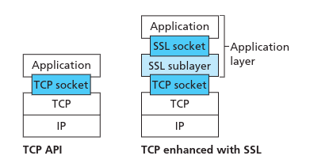

- Although SSL techinically resides in the application layer, from the developer's perspective it is a transport protocol that provides TCP's services enhanced with security services.
- SSL has 3 phases: handshake, key derivation, and data transfer.

### 5.1. Handshake

- During the handshake phase, Bob needs to:
  - Establish a TCP connection with Alice.
  - Verify that Alice is really Alice.
  - Send Alice a master secret key, which will be used by both Alice and Bob to generate all the symmetric keys they need for the SSL session.

  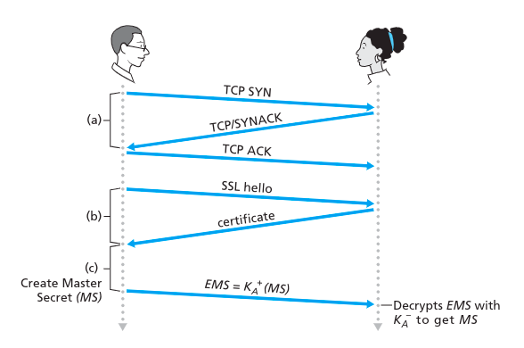

  - SSL allow Alice and Bob to agree on the cryptographic algorithms at the begining of the SSL session, during the handshake phase.
  - Alice and Bob send nonces(*) to each other, which are used in the creation of the session keys.
    - The client sends a list of cryptographic algorithms it supports, along with a client nonce.
    - From the list, the server chooses a symmetric algorithm (e.g. AES), a public key algorithm (e.g. RSA), and a Message authentication code (MAC) algorithm. It sends back to the client its choices, as well as a certificate and a server nonce.
    - The client verifies the certificate, extracts the server's public key, generates a Pre-Master Secret (PMS), encrypts the PMS with the server's public key, and send the encrypted PMS to the server.
    - Using the key derivation function, The client and server independently compute the Master Secret (MS) from the PMS and nonces. The MS is then sliced up to generate the 2 encryption and two MAC keys. All messages sent between client and server are encrypted and authenticated with the MAC.
    - The client sends a MAC of all the handshake messages.
    - The server sends a MAC of all the handshake messages.
  - (*) Nonces are used to defend against the "connection replay attack".

### 5.2. Key derivation

- It is safer for Alice and Bob to each use different cryptographic keys, and also to use different keys for encryption and integrity checking. Thus, both Alice and Bob use the MS to generate 4 keys:
  - Eb = session encryption key for data sent from Bob to Alice.
  - Mb = session MAC key for data sent from Bob to Alice.
  - Ea = session encryption key for data sent from Alice to Bob.
  - Ma = session MAC key for data sent from Alice to Bob.
- The 2 encryption keys will be used to encrypt data; the 2 MAC keys will be used to verify the integrity of the data.

### 5.3. Data transfer

- Since TCP is a byte-stream protocol, SSL breaks the data stream into *records*, append a MAC to each record for integrity checking, and then encrypts the record+MAC.
- To create the MAC, Bob inputs the record data along with the key Mb into a hash function.
- To encrypt the package record+MAC, Bob uses his session encryption key Eb. This encrypted package is then passed to TCP for transport over the Internet.
- However, a man-in-the-middle may have the ability to insert, delete, and replace segments in the stream of TCP and change the TCP sequence numbers (which are not encrypted) -> Byte stream received by Alice will be incorrect.
- Solution:
  - Bob maintains a sequence number counter, which begins at 0 and increases for each SSL record he sends.
  - Bob will include a sequence number in the MAC calculation. The MAC is now a hash of the data + Mb + current sequence number.
  - Alice tracks Bob's sequence numbers, allowing her to verify the data integrity of a record by including the appropriate sequence number in the MAC calculation.

  -> sequence numbers are used to defend again replaying individual packets during an ongoing session.

### 5.4. SSL record

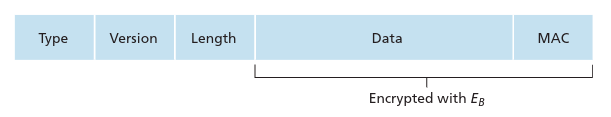

- The SSL record consists of a type field, version field, length field, data field, and MAC field.
- The first 3 fields are not encrypted.
- The type field indicates whether the record is a handshake message or a message that contain application data. It also used to close the SSL connection.
- SSL at the receiving end uses the length field to extract the SSL records out of the incoming TCP byte stream.

### 5.5. Connection closure

- One approach would be to let Bob end send the SSL session by simply terminating the underlying TCP connection (Bob sends a TCP FIN segment to Alice).
- To prevent man-in-the-middle attack, the type field is used to indicate whether the record serves to terminate the SSL session (although the SSL type is sent in the clear, it is authenticated at the receiver using the record's MAC).
- By including such a field, if Alice were to receive a TCP FIN before receiveing a closure SSL record, she would known that something went wrong.

## 6. Securing UDP connections: DTLS

- The **Datagram Transport Layer Security (DTLS)** protocol provides communication privacy for data gram protocols.
- The protocol allows client and server applications to communicate in a way that is designed to prevent eavesdropping, tampering, or message forgery.
- The DTLS protocol is based on the TLS protocol, and it provides equivalent security guarantees. However, DTLS has additional responsibility during the handshake phase:
  - Packet loss: if 1 packet is lost at the receiving end then the sender is going to retransmit that packet again, after the timer has expired.
  - Reordering: If the packet has reached the receiving end out of order then that packet is going to be buffered unless the intended packet has achieved.
    - Reordering can be produced by using 2 new fields in the record: *epoc* and *sequence_number*.
  - Large message size: If the message size is larger than the MTU (there are 2 kinds of packets in handshake which basically can be very large sized packet: key exchange and the certificates), the message will be fragmented.

### 6.1. Cipher Suites

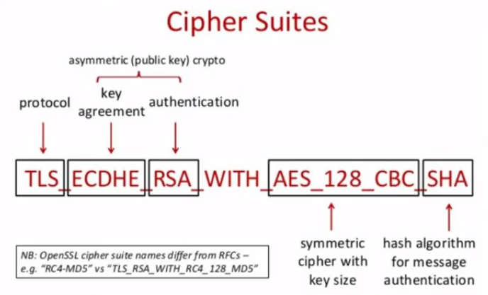

- Cipher suites is a collection of data that represent what kind of algorithms or what kind of elements are going to be used for providing authenticity and confidentiality for the data that is going to travel from one end to the other end of the socket.
- The set of algorithms that cipher suites usually contain:
  - Key exchange algorithm: used to exchange a key between 2 devices.
  - Bulk encryption algorithm: used to encrypt the data being sent.
  - Message authentication code (MAC) algorithm: provides data integrity checks to ensure that the data sent does not change in transit.
  - In addition, cipher suites can include signatures and an authentication algorithm to help authenticate the server or client.

### 6.2. DTLS Handshake

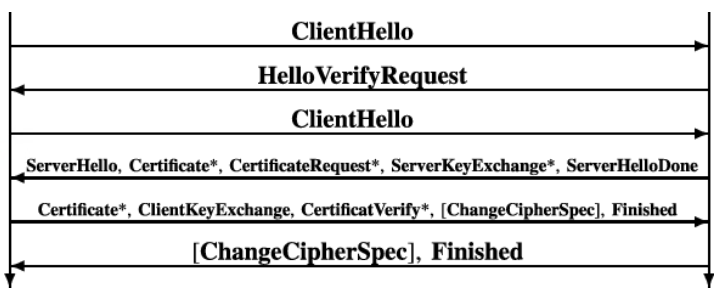

- Steps:
  - The client sends a *ClientHello* message to the server that contains a list of supported ciphers it supports and what is the protocol version that it uses, a random number along with some important parameters.
  - The server responds to the client with a *HelloVerifyRequest*.
    - The server generate a stateless cookie (20-byte length crafted based on source IP, source port, destination IP, destination port, and some kind of randomness) and send to the client.
  - The client sends the same cookie again in the  *ClientHello* to the server -> avoid DoS attack.
  - The server sends a *ServerHello* packet to the client that contains the cipher suites and protocol version that the server supports, a random number along with few importain parameters.
  - The server sends its certificate to the client that also contains the server public key. The client needs to verify that certificate using a CA certificate. The server can optionally sends *ServerKeyExchange* and *CertificateRequest* pakets.
  - Once the client verifies the server, the client can optionally send the client certificate to the server.
  - The server sends a *ServerHelloDone* packet to inform the client that everything has been provided to the client.
  - The client use key exchange algorithm if specifed to generate a premaster secret. If no algorithm specifed, the client uses RSA as default algorithm. A *ClientKeyExchange* packet will be generated and sent to the server which includes the premaster secret.
    - The premaster secret will be used to generate a symmetric key used for further encryption and decryption of the data.
    - *ClientKeyExchange* need to go to server in a encrypted way using the public key that is shared in the certificate or using the server key exchange.
  - The premaster secret along with the random numbers that have been shared in *ClientHello* and *ServerHello* will be used in the **Pseudo Random Function** (PRF(premaster secret, client random, server random)) which will generate a session key. The session key will be used to generate 6 keys on each side (enc read key, enc write key, hash read key, hash write key, iv read key, iv write key).
  - The server send *ChangeCipherSpec* packet - the final packet of the handshake - and encrypted data to the client. The packet contains the integrity of all the handshake messages that were previously exchanged.
  - The client will decrypt the packet using its own keys set it has generated and sends the *ChainCypherSpec* that encrypted to the server. It has the same content that the server sent.
  - The channel now is enrypted.
