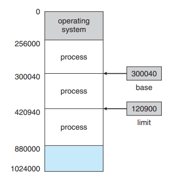
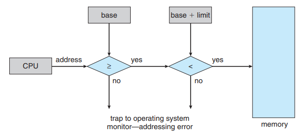

# Memory Management

## 1. Main Memory

### 1.1. Background

- Memory is central to the operation of a modern computer system.
- Memory consists of a large array of bytes, each with its own address.
- CPU fetches instructions from memory according to the value of the program counter. These instructions may cause additional loading from and storing to specific memory addresses.
- A typical instruction-execution cycle:
  - Fetches an instruction from memory.
  - The instruction is then decoded and may cause operands to be fetched from the memory.
  - After the instruction has been executed on the operands, results may be stored back in memory.

#### 1.1.1. Basic Hardware

- Main memory and the registers built into the processor itself are the only storage that the CPU can access directly.
- There are machine instructions that take memory addresses as arguments, but none that take disk addresses -> any data being used by the instructions, must be in one of these direct-access storage devices.
- If the data are not in memory, they must be moved there before the CPU can operate on them.
- Registers that are built into the CPU are generally accessible within one cycle of the CPU clock.
- Most CPUs can decode instructions and perform simple operations on register contents at the rate of one or more operations per clock tick.
- However, completing a memory access may take may cycles of the CPU clock. In such cases, the processor normally needs to **stall**, since it does not have the data required to complete the instruction that it is executing.
- Solutions: add fast memory between the CPU and main memory, typically on the CPU chip for fast access (**cache**).
  - Cache is a faster storage system. When information is used, it is copied into the cache on a temporary basis.
  - When a piece of information is needed, we first check whether it is in the cache. If it is, we use the information directly from the cache. If it is not, we use the information from the source, putting a copy in the cache under the assumption that we will need it again soon.
- To manage a cache built into the CPU, the hardware automatically speeds up memory access without any OS control.
- Each process has a separate memory space. Separate per-process memory space protects the processes from each other and is fundamental to having multiple processes loaded in memory for concurrent execution.
  
  

- This protection can be provided by using 2 registers, usually a base and a limit.
  - Base register holds the smallest legal physical memory address.
  - Limit register specifies the size of the range.
- Protection of memory space is accomplished by having the CPU hardware compare every address generated in user mode with the registers.
  - Any attempt by a program executing in user mode to access OS memory or other user's memory results in a trap to the OS, which treats the attempt as a fatal error.
  - This scheme prevents a user program from modifying the code or data structures of either the OS or other users.
  
  

- The base and limit registers can be loaded only by the OS. This scheme allows the OS to change the value of the registers but prevents user programs from changing the registers's contents.
- The OS, executing in kernel mode, is given unrestricted access to both OS memory and user's memory. This allows the OS to:
  - Load user's program into user's memory
  - Dump out those programs in cases of error
  - Access and modify parameters of system calls
  - Perform I/O to and from user memory
  - Provide many other services.
  
#### 1.1.2. Address Binding

- A program resides on a disk as a binary executable file.
- To be executed, the program must be bought into memory and placed within a process.
- Depending on the memory management in use, the process may be moved between disk and memory during its executation. The processes on the disk that are waiting to be bought into memory for execution form the **input queue**.