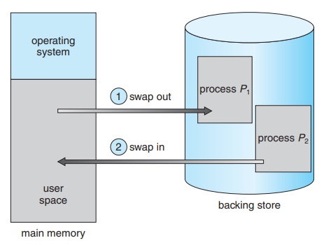

# Memory Management

## 1. Main Memory

### 1.1. Background

- Memory is central to the operation of a modern computer system.
- Memory consists of a large array of bytes, each with its own address.
- CPU fetches instructions from memory according to the value of the program counter. These instructions may cause additional loading from and storing to specific memory addresses.
- A typical instruction-execution cycle:
  - Fetches an instruction from memory.
  - The instruction is then decoded and may cause operands to be fetched from the memory.
  - After the instruction has been executed on the operands, results may be stored back in memory.

#### 1.1.1. Basic Hardware

- Main memory and the registers built into the processor itself are the only storage that the CPU can access directly.
- There are machine instructions that take memory addresses as arguments, but none that take disk addresses -> any data being used by the instructions, must be in one of these direct-access storage devices.
- If the data are not in memory, they must be moved there before the CPU can operate on them.
- Registers that are built into the CPU are generally accessible within one cycle of the CPU clock.
- Most CPUs can decode instructions and perform simple operations on register contents at the rate of one or more operations per clock tick.
- However, completing a memory access may take may cycles of the CPU clock. In such cases, the processor normally needs to **stall**, since it does not have the data required to complete the instruction that it is executing.
- Solutions: add fast memory between the CPU and main memory, typically on the CPU chip for fast access (**cache**).
  - Cache is a faster storage system. When information is used, it is copied into the cache on a temporary basis.
  - When a piece of information is needed, we first check whether it is in the cache. If it is, we use the information directly from the cache. If it is not, we use the information from the source, putting a copy in the cache under the assumption that we will need it again soon.
- To manage a cache built into the CPU, the hardware automatically speeds up memory access without any OS control.
- Each process has a separate memory space. Separate per-process memory space protects the processes from each other and is fundamental to having multiple processes loaded in memory for concurrent execution.
  
  

- This protection can be provided by using 2 registers, usually a base and a limit.
  - Base register holds the smallest legal physical memory address.
  - Limit register specifies the size of the range.
- Protection of memory space is accomplished by having the CPU hardware compare every address generated in user mode with the registers.
  - Any attempt by a program executing in user mode to access OS memory or other user's memory results in a trap to the OS, which treats the attempt as a fatal error.
  - This scheme prevents a user program from modifying the code or data structures of either the OS or other users.
  
  

- The base and limit registers can be loaded only by the OS. This scheme allows the OS to change the value of the registers but prevents user programs from changing the registers's contents.
- The OS, executing in kernel mode, is given unrestricted access to both OS memory and user's memory. This allows the OS to:
  - Load user's program into user's memory
  - Dump out those programs in cases of error
  - Access and modify parameters of system calls
  - Perform I/O to and from user memory
  - Provide many other services.
  
#### 1.1.2. Address Binding

- A program resides on a disk as a binary executable file.
- To be executed, the program must be bought into memory and placed within a process.
- Depending on the memory management in use, the process may be moved between disk and memory during its executation. The processes on the disk that are waiting to be bought into memory for execution form the **input queue**.
- A user program goes through serveral steps:

  

- Addresses may be represented in different ways during these steps. Addresses in the source program are symbolic. A compiler **binds** these symbolic addresses to relocatable addresses.
- The linkage editor or loader in turn binds the relocatable addresses to absolute addresses. Each binding is a mapping from one address space to another.
- The binding of instructions and data to memory addresses can be done at any step along the way:
  - Compile time: At compile time, the process will reside in memory, **absolute code** can be generated.
  - Load time: If it is not known at compile time where the process will reside in memory, then the compiler must generate **relocatable code**. In this case, final bindings is delayed until load time. If the starting address changes, we need only reload the user code to incorporate this changed value.
  - Execution time: if the process can be moved during its execution from one memory segment to another, then binding must be delayed until run time.

#### 1.1.3. Logical vs Physical Address Space

- An address generated by the CPU is referred to as a **logical address**.
- An address seen by the memory unit is referred to as a **physical address**.
- The compile-time and load-time address-binding methods generate identical logical and physical addresses. The execution-time address-binding method results in differing logical and physical addresses.
- The set of all logical addresses generated by a program is a **logical address space**.
- The set of all physical addresses corresponding to these logical addresses is **physical address space**.
  
  -> In the execution-time address-binding scheme, the logical and physical address spaces differ.

- The run-time mapping from virtual to physical addresses is done by a hardware device called the **memory-management unit (MMU)**.
  
  

  - The base register is now called a **relocation register**.
  - The value in the relocation register is added to every address generated by a user process at the time the address is sent to memory.
  - E.g. If the base is at 1400, then an attempt by the user to address location 0 is dynamically relocated to location 1400; an access to location 346 is mapped to location 14346.
- The user program never sees the real physical addresses. The user program generates only logical addresses (in the range 0 to max) and thinks that the process run in locations 0 to max. However, these logical addresses must be mapped to physical addresses (in the range R + 0 to R + max) before they are used.

#### 1.1.4. Dynamic Loading

- It is necessary for the entire program and all data of a process to be in physical memory for the process to execute -> the sized of a process has been limited to the size of physical memory.
- To obtain better memory-space utilization, we can use **dynamic loading**.
  - A routine is not loaded until it is called.
  - All routines are kept on disk in a relocatable load format.
  - The main program is loaded into memory and is executed.
  - When a routine needs to call another routin, the calling routine first checks to see whether the other routine has been loaded. If it has not, the relocatable linking loader is called to load the desired routine into memory and to update the program's address tables to reflect this change.
  - Control is passed to the newly loaded routine.
- Advantage: useful when large amounts of code are needed to handle infrequently occurring cases.
- Dynamic loading does not require special support from the OS.

#### 1.1.5. Dynamic Linking

- To perform a linking task, a linked is used. A linker is a program that takes one or more object files generated by a compiler and combines them into a single executable file.
- Static linking: the linker combines all necessary program modules into a single executable program -> no run time dependency. Some OSs support only static linking, in which system libraries are treated like any other object module.
- Dynamic linking: the basic concept of dynamic linking is similar to dynamic loading. In dynamic linking, **stub** is included for each appropriate library routine reference.
  - A stub is a small piece of code that indicates how to locate the appropriate memory-resident library routine or how to load the library if the routine is not already present.
  - When a stub is executed, it checks whether the needed routine is already in memory or not. If not available then the program loads the routine into memory.

### 1.2. Swapping

- Swapping is a process of swap a process temporarily into a **backing store** from the main memory.
  - The backing stor is commonly a fast disk. It must be large enough to accommodate copies of all memory images for all users, and it must provide direct access to these memory images.
- A swapping allows more processes to be run and can be fit into memory at one time.
  
  

- The main part of swapping is transferred time and the total time directly proportional to the amount of memory swapped.
- Swapping is also known as roll out, roll in, because if a higher priority process arrives and wants service, the memory manager can swap out the lower priority process and then load and execute the higher priority process.
- After finishing higher priority work, the lower priority process swapped back in memory and continued to the execution process.

### 1.3. Contigous Memory Allocation

- The main memory must accommodate both the OS and the user processes.
- The memory is usually divided into 2 partitions: one for the resident OS and one for the user processes.
- We usually want several user processes to reside in memory at the same time.
- In contiguous memory allocation, each process is contained in a single section of memory that is contiguous to the section containing the next process.

### 1.3.1 Memory Allocation

- One of the simplest methods for allocating memory is to divide memory into several fixed-sized partitions. Each partition may contain exactly one process.
- **Multiple-partition** method: a process is selected from the input queue and loaded into the free partition. When the process terminates, the partition becomes available for other processes.
- **Variable-partition** scheme: the OS keeps a table indicating which parts of memory are available and which are occupied. Initially, all memory is available for user processes and is considered one large block of available memory, a **hole**.
  - When the process arrives and needs memory, we search for a hole that is large enough to store this process.
  - If the requirement fulfills then we allocate memory to process, otherwise keeping the rest available to satisfy future requests.
  - If the new hole is adjacent to other holes, these adjacent holes are merged to form one larger hole.
- While allocating a memory, sometimes dynamic storage allocation problems occur, which concerns how to satisfy a request of size n from a list of free holes. There are some solutions to this problem:
  - **First fit**: allocate the first hole that is big enough.
  - **Best-fit**: allocate the smallest hole that is big enough -> must search the entire list, unless the list is ordered by size -> produces the smallest leftover hole.
  - **Worst-fit**: allocate the larges hole -> must search the entire list, unless the list is ordered by size -> produces the larges leftover hole.

### 1.3.2. Fragmentation

- As processes are loaded and removed from memory, the free memory space is broken into little pieces.
- Both the first-fit and bes-bit strategies suffer from **external fragmentation**.
- External fragmentation exists when there is enough total memory space to satisfy a request but the available spaces are not contiguous.
- One solution to the problem of external fragmentation is **compaction**. The goal is to shuffle the memory contents so as to place all free memory together in one large block.
- Another possible solution to the external-fragmentation problem is to permit the logical address space of the processes to be noncontiguous, thus allowing a process to be allocated physical memory wherever such memory is available.

### 1.4. Segmentation

- **Segmentation** is a memory-management scheme in which each job is divided into several segments of different sizes, one for each module that contains pieces that perform related functions.
- A logical address space is a collection of segments.
- Each segment has a name and a length. The addresses specify both segment name and the offset within the segment.
- For simplicity of implementation, segments are numbered and are referred to by a segment number, rather than by a segment name.

  -> a logical address consists of a two tuple:

  ```text
  <segment-number, offset>
  ```

- Although objects in the program can be referred as a two-dimensional address, the actual physical memory is still a one-dimensional sequence of bytes -> must define an implementation to map two-dimensional addresses into one-dimensional.
- This mapping is effected by a **segment table**. Each entry in the segment table has:
  - **Segment base**: contains the starting physical address where the segment resides in memory.
  - **Segment limit**: specifies the length of the segment.

  

  - A logical address consists of 2 parts: a segment number *s* and an offset into that segment *d*.
  - The segment number is used as an index to the segment table.
  - The offset *d* must be between 0 and the segment limit.
    - If it is not, trap to the OS.
    - If it is legal, it its added to the segment base to produce the address in physical memory of the desired byte.

  -> The segment table is an array of base-limit register pairs.

### 1.5. Paging

- **Paging** is another memory-management scheme that offers the physical address space of a process to be noncontiguous.
- Paging is a memory management technique in which process address space is broken into blocks of the same size called **pages** (size is power of 2, between 512 bytes and 8192 bytes). The size of the process is measured in the number of pages.
- Main memory is divided into small fixed-sized blocks of physical memory called **frames** and the size of a frame is kept the same as that of a page to have optimum utilization of the main memory and to avoid external fragmentation.