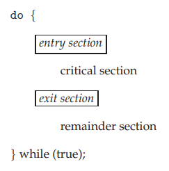

# Mutex and Semaphore

- A race condition occurs when 2 or more threads can access shared data and they try to change it at the same time.
- To guard against the race condition, we need to ensure that only one thread at a time can be manipulating the variable counter -> require that the threads be synchronized.

## 1. Critical Section

- Critical section is a section of code that accesses a shared resource and whose execution should be atomic; that is, its execution should not be interrupted by another thread that simultaneously accesses the same shared resource.
- Each thread must request permission to enter its critical section. The section of code implementing this request is the *entry section*.
- The critical section may be followed by an *exit section*. The remaining code is the *remainder section*.

    

- A solution to the critical-section problem must satisfy the following requirements:
  - Mutual exclution: if a thread is executing in its critical section, then no other threads can be executing in their critical sections.
  - Progress: If no process is executing in its critical section and some threads wish to enter their critical sections, then only those threads that are not executing in their remainder sections can participate in deciding which will enter its critical section next, and this selection cannot be postponed indefinitely.
  - Bounded waiting: there exists a bound, or limit, on the number of times that other processes are allowed to enter their critical sections after a thread has made a request to enter its critical section and before that request is granted.

## 2. Mutual exclusion (Mutex)

### 2.1. Synchronization Hardware

- Hardware-based solutions to the critical-section problem are based on the premise of **locking**- that is, protecting critical sections through the use of locks.
- The critical-section problem could be solved simply in a single-proccessor environment if we could disable interrupts while shared variables are being modified.

  ```C
  do {
    [disable interrupts]

    /* critical section */

    [enable interrupts]

    /* remainder section */
  } while (true);
  ```

  - This solution is not as feasible in a multiprocessor environment.
  - Disabling interrupts on a multiprocessor can be time consuming.
- The test_and_set() instruction is executed atomically: if 2 test_and_set() are executed simultaneously, they will be executed sequentially in some arbitrary order. 

    ```C
    boolean test_end_set(boolean *target) {
        boolean rv = *target;
        *target = true;

        return rv;
    }
    ```

    ```C
    do {
        while (test_and_set(&lock))
            ; /* do nothing */
            /* critical section */
        lock = false;
            /* remainder section */
    } while (true);
    ```

- The compare_and_swap() instruction operates on three operands.
  - The operand value is set to new_value only if the expression (*value == expected) is true.
  - compare_and_swap() always returns the original value of the variable value.
  - compare_and_swap() is executed atomically.
- Mutual exclution can be provided as follows:
  - A global variable (lock) is declared and initialized to 0
  - The first thread that invokes compare_and_swap() will set lock to 1. It will then enter its critical section, because the original value of lock was equal to the expected value of 0.
  - Subsequent calls to compare_and_swap() will no succeed, because lock now is not equal to the expected value of 0.
  - When a thread exits its critical section, it sets lock back to 0, which allows another thread to enter its critical section.

    ```C
    int compare_and_swap(int *value, int expected, int new_value) {
        int temp = *value;
        if (*value == expected)
            *value = new_value;
        return temp;
    }
    ```

    ```C
    do {
        while (compare_and_swap(&lock, 0, 1) != 0)
            ; /* do nothing */
            /* critical section */
        lock = 0;
            /* remainder section */
    } while (true);
    ```

- Although the algorithms is satisfy the mutual-exclusion requirement, it do not satisfy the bounded-waitin requrirement. Another algorithm using the test_and_set() instruction that satisfies all the critical-section requirements is shown as below.

    ```C
    do {
        waiting[i] = true;
        key = true;
        while (waiting[i] && key)
            key = test_and_set(&lock);
        waiting[i] = false;
            /* critical section */
        j = (i + 1) % n;
        while ((j != i) && !waiting[j])
            j = (j + 1) % n;
        if (j == i) lock = false;
        else waiting[j] = false;
            /* remainder section */
    } while (true);
    ```

  - The common data structure are:

    ```C
    boolean waiting[n];
    boolean lock;
    ```

  - These data structures are initialized to false.
  - Prove the mutual-exclusion requirement:
    - A thread can enter its critical section only if either waiting[i] == false or key == false. The value of key can become false only if the test_and_set() is executed.
    - The first thread to execute the test_and_set() will find key == false; all others must wait.
    - The variable waiting[i] can become false only if another process leaves its critical section; only one waiting[i] is set to false, maintaining the mutual-exclusion requirement.
  - Prove the progress requirement:
    - The arguments presented for mutual exclution also apply here, since a process exiting the critical section either set lock to false or set waiting[j] to false. Both allow a thread that is waiting to enter its critical section to proceed.
  - Prove the bounded-waiting requirement:
    - When a thread leaves its critical section, it scans the array waiting in the cyclic ordering (i+1, i+2,..., n-1, 0,..., i-1).
    - It designates the first thread in this ordering that is in the entry section (waiting[j] == true) as the next one to enter the critical section.
    - Any thread waiting to enter its critical section will thus do so within n - 1 turns.

### 2.2. Mutex Locks

- The hardware-based solutions to the critical-section problem are complicated as well as generally inaccessible to application programmers.
- Operating-systems designers build software tools to solve the critical-section problem. The simplest of these tools is the **mutex lock**.
- The mutex lock is used to protect critical regions and thus prevent race conditions.
- A mutex has 2 states: locked and unlocked (acquire and release).
  - At any moment, at most one thread may hold the lock on a mutex. Attempting to lock a mutex that is already locked either blocks or fails with an error, depending on the method used to place the lock.
  - When a thread locks a mutex, it becomes the owner of that mutex. Only the mutex owner can unlock the mutex. This property improves the structure of code that uses mutexes and also allows for some optimizations in the implementation of mutexes.
- In general, we employ a different mutex for each shared resource, and each thread employs the following protocol for accessing a resource:
  - Lock the mutex for the shared resource
  - Access the shared resouce
  - Unlock the mutex
- If multiple threads try to execute this block of code (a critical section), only one thread which hold the mutex can enter the section, the others remain blocked.
- A mutex lock has a boolean variable *available* whose value indicates if the lock is available or not. If the lock is available, a call to acquire() succeeds, and the lock is then considered unavailable. A thread that attempts to acquire an unavailable lock is blocked until the lock is released.
- Definition of acquire():

  ```C
  acquire() {
    while (!available)
      ; /* busy wait */
    available = false;
  }
  ```

- Definition of release():

  ```C
  release() {
    available = true;
  }
  ```

- Call to either acquire() or release() must be performed atomically
  
  -> mutex locks are often implemented using one of the hardware mechanisms.

- The main disadvantage of the implementaion is that it requires **busy waiting**.
  - While a thread is in its critical section, any other process that tries to enter its critical section must loop continuously in the call to acquire().
  - This type of mutex lock is also called a **spinlock** because the thread "spins" while waiting for the lock to become available.
  - Busy waiting wastes CPU cycles that some other thread might be able to use productively.
- Spinlocks have an advantage, however, in that no context switch is required when a thread must wait on a lock, and a context switch may take considerable time.
  
  -> when locks are expected to be held for short times, spinlocks are useful.

  - They are often employed on multiprocessor systems where one thread can "spin" on one processor while another thread performs its critical section on another processor.

## 3. Semaphores

- Semaphor is a kernel object to realize synchronization and mutual exclusion.
- A semaphor S is an integer variable that is accessed only through 2 standard atomic operations:
  - wait(): originally termed P() (from Dutch **proberen**, "to test")

    ```C
    wait(S) {
      while (S <= 0)
        ; // busy wait
      S--;
    }
    ```

  - signal(): originally termed V() (from **verhogen**, "to increment")

    ```C
    signal(S) {
      S++;
    }
    ```

- wait() and signal() are indivisible atomic operations: when one thread modify the semaphore value, no other thread can simultaneously modify the same semaphore.

## 3.1. Semaphore usage

- Operating systems often distinguish between counting and binary semaphores.
  - The value of a **counting semaphore** can range over an unrestricted domain.
    - Can be used to control access to a given resource consisting of a finite number of instances.
    - The semaphore is initialized to the number of resources available.
    - Each thread that wishes to use a resource performs a wait() operation on the semaphore.
    - When a thread releases a resource, it performs a signal() operation.
    - When the count for the semaphore goes to 0, all resources are being used.
    - After that, threads that wish to use a resource will block until the count becomes greater than 0.
  - The value of a **binary semaphore** can range only between 0 and 1.
    - Behave similarly to mutex locks.
    - Can be used to providing mutial exclusion if a system does not provide mutex locks.
- Semaphores can solve various synchronization problems.

### 3.2. Semaphore implementation

- The definitions of the wait() and signal() semaphore operations still suffer from busy waiting. To overcome the need for busy waiting, the definition of these operations can be modified as follow:
  - When a thread execute the wait() operation and finds that the semaphore value is not positive, it must wait.
  - However, rather than engaging in busy waiting, the thread can block itself.
  - The block operation places a thread into a waiting queue associated with the semaphore, and the state of the thread is switched to the waiting state.
  - Control is transferred to the CPU scheduler, which selects another thread to execute.
  - A thread that is blocked, waiting on a semaphore S, should be restarted when some other thread executes a signal() operation.
  - The thread is restarted by a wakeup() operation, which changes the thread from the waiting state to the ready state.
  - The thread is then placed in the ready queue.
- To implement semaphores unther this definition, a semaphore is defined as follows:

  ```C
  typdef struct {
    int value;
    struct thread *list;
  } semaphore;
  ```

  - Each semaphore has an integer *value* and a list of threads *list*.
  - When a thread must wait on a semaphore, it is added to the list of threads.
  - A signal() operation removes one thread from the list of waiting threads and awakens that thread.
  - wait() semaphore operation:

    ```C
    wait(semaphore *S) {
      S->value--;
      if (S->value < 0) {
        add this thread to S->list;
        block();
      }
    }
    ```
  
  - signal() semaphore operation:

    ```C
    signal(semaphore *S) {
      S->value++;
      if (S->value <= 0) {
        remove a thread T from S->list;
        wakeup(T);
      }
    }
    ```
  
  - The block() operation suspends the thread that invokes it.
  - The wakeup(T) operation resumes the execution of a blocked thread T.
  - These 2 operations are provided by the OS as basic system calls.
  - Semaphore values may be negative, if a semaphore value is negative, its magnitude is the number of threads waiting on that semaphore.
- It is critical that semaphore operations be executed atomically.
- Must guarantee that no 2 threads can execute wait() and signal() operations on the same semaphore at the same time.
- Solutions:
  - In a single-processor environment: inhibiting interrupts during the time the wait() and signal() operations are executing.
  - In a multiprocessor environment: may use spinlocks.