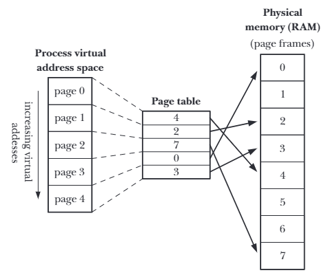
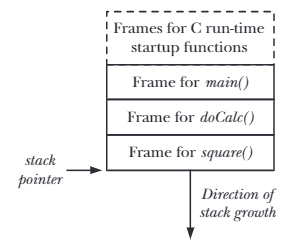
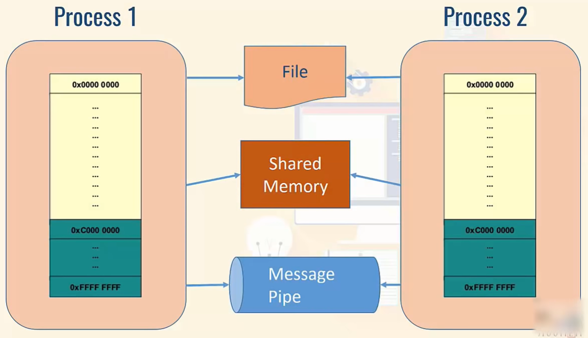
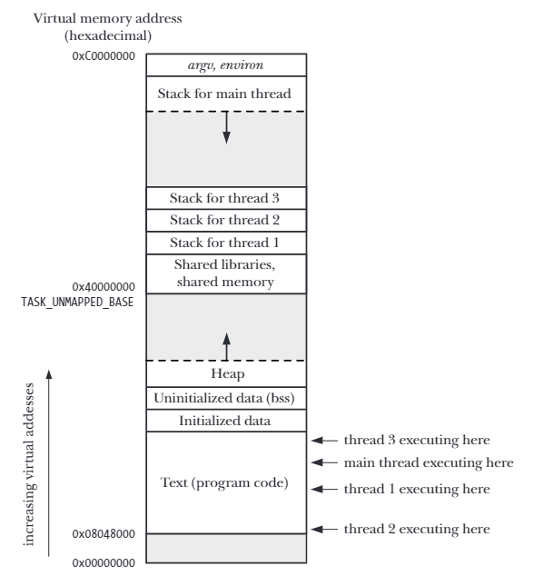
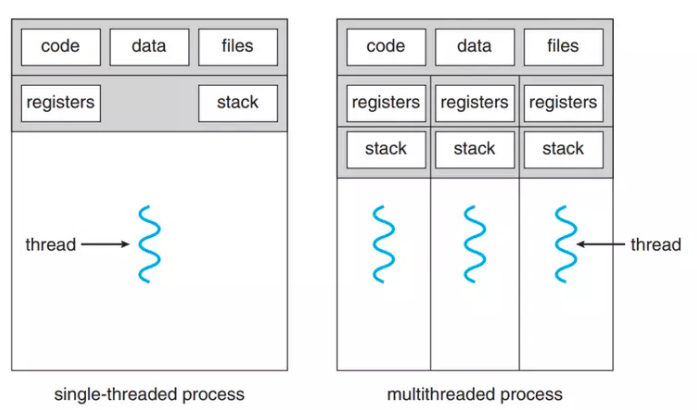

# Processes and Threads

## 1. Processes

### 1.1. Processes and Programs

- A process is an instance of an executing program.
- A program i a file containing a range of information that describes how to contruct a process at run time.
- One program may be used to construct many processes, or, may processes may be running the same program.
- Another process definition: a process is an abstract entity, defined by the kernel, to which system resources are allocated in order to execute a program.

### 1.2. Process ID

- Each process has a process ID (PID), a positive integer that uniquely identifies the process on the system.
- There is no fixed relationship between a program and the process ID of the process that is created to run that program, except a few system processes such as *init* (PID = 1).
- The Linux kernel limits process IDs to being less than or equal to 32,767.
  - When a new process is created, it is assigned the next sequentially available process ID.
  - Each time the limit of 32,767 is reached, the kernel resets its process ID counter to 300 because many system processes and deamons use the process IDs in range 1-300 pernamently.
- Each process has a parent - the process that created it.
- The parent of each process has its own parent, and so on, going all the way back to process 1, *init*, the ancestor of all processes.
- If a child process becomes orphaned because its "birth" parent terminates, then the child is adopted by the *init* process.

### 1.3. Memory Layout of a Process

- The memory allocated to each process is composed a number of parts, usually referred to as segments:
  - Text segment: contain the machine-language instructions of the program run by the process. The text segment is read-only and sharable so that a single copy o the program code can be mapped into the virtual address space of all the processes.
  - Initialized data segment: contains global and static variables that are explicitly initialized. The values of these variables are read from the executable file when the program is loaded into memory.
  - Uninitialized data segment (bss segment): contains global and static variables that are not explicitly initialized.
  - Stack: is a dynamically growning and shrinking segment containing stack frames. One stack frame is allocated for each function. A frame stores the function's local variables, arguments, and return value.
  - Heap: is an area from which memory (for variables) can be dynamically allocated at run time. The top end of the heap is called program break.

### 1.4. Virtual Memory Management

- Like most modern kernels, Linux employs a technique known as virtual memory management. The aim of this technique is to make efficient use of both the CPU and RAM by exploiting a property that is typical of most programs: *locality of reference*.
- A virtual memory scheme splits the memory used by each program into small, fixed-size units called *pages*.
- RAM is divided into a series of *page frames* of the same size.
- At any one time, only some of the pages of a program need to be resident in physical memory page frames; these pages form the so-called *resident set*.
- Copies of the unused pages of a program are maintained in the *swap area*.
- When a process references a page that is not currently resident in physical memory, a *page fault* occurs,  at which point the kernel suspends execution of the process while the page is loaded form disk into memory.

    

- The kernel maintains a page table for each process.
  - The page table describe the location of each page in the process's virtual address space (the set of all virtual memory pages available to the process).
  - Each entry in the page table either indicates the location of a virtual page in RAM or indicates that it currently resides on disk.
- A process's range of valid virtual addresses can change over its lifetime, as the kernel allocates and deallocates pages (and page table entries) for the process.
- Virtual memory management separates the virtual address space of a process from the physical address space of RAM. This provides may advantages:
  - Processes are isolated from one another and from the kernel, since the page table entries for each process point to distinct sets of physical pages in RAM or in the swap area.
  - When appropriate, 2 or more processes can share memory by having page table entries in different processes refer to the same pages of RAM.
    - Multiple processes executing the same program can share a single copy of the program code.
    - Processes can request sharing of memory regions with other processes because of interprocess communication.
  - Page table entries can be marked to indicate that the content of the corresponding page are readable, writeable, executable,... Where multiple processes share pages of RAM, it is possible to specify that each process has different protections on the memory.
  - Programemers, and tools such as the compiler and linker, don't need to be concerned with the physical layout of the program in RAM.
  - Because only a part of a program needs to reside in memory, the program loads and runs faster.
  - Since each process uses less RAM, more processes can simultaneously be held in RAM -> better CPU utilizaion.

### 1.5. Stack and Stack Frames

- The stack grows and shrinks linearly as functions are called and return.
- For Linux on the x86-32 architecture (and on most other Linux and UNIX implementations), the stack resides at the high end of memory and grows downward.
- A special-purpose register, the stack pointer, tracks the current top of the stack.
- Each time a function is called, an additional frame is allocated on the stack, and this frame is removed when the function returns.
- Since functions can call one another, there may be multiple frames on the stack. If a function calls itself recursively, there will be multiple frames on the stack for that function.

    

### 1.6. Multiprocess

- A multiprocessing system has more than 2 processors. The CPUs are added to the system that helps to increase the computing speed of the system. Every CPU has its own set of registers and main memory.
- However, because each CPU are separate, it may happen that one CPU may not have anything to process. One processor may sit idle, and the other may be overloaded with the specific processes. In such case, the process and resources are shared dynamically among the processors.

    

- Multiprocessing pros:
  - If one of the processes crashes, it doesn't mean the entire application crashes -> easily recover.
  - It's much easier to debug in multiprocessing since its's easier to treat a small atomic process than a multithread
  - Error or memory leak in one process won't hurt execution of another process.
  - Multiprocessing is scalable.
- Multiprocessing cons:
  - Communication is a major drawback. Communicating between processes is complex. It requires custom development in order to share data and maintain locks and synchronization.
  - Number of supporting libraries is relatively small.

## 2. Threads

### 2.1. Overview

- Thread are a mechanism that permits an application to perform multiple tasks concurrently.
- A single process can contain multiple threads. All of these threads are independently executing the same program, and they all share the same global memory, including the initialized data, uninitialized data, and heap segments.
- The threads in a process can execute concurrently. On a multiprocessor system, multiple threads can execute parallel. If one thread is blocked on I/O, other threads are still eligible to execute.

    

- When a program started, the resulting process consists of a single thread, called the initial or main thread.
  - If no other thread created, the process is called single-thread.
  - If other threads created, the process is called multi-thread.
- Each thread within a process is uniquely identified by a thread ID. Thread ID is not neccessary to be an integer, it can be a struct.
- There are 2 main types of threads:
  - User-level threads: implemented by users and the kernel is not aware of the existence of these threads.
  - Kernel-level threads: handled by the operating system directly and the thread management is done by the kernel.
- By default, a thread is joinable, meaning that when it terminates, another thread can obtain its return status. If we want to clean up and remove the thread, we mark a thread as *detached*.
  - Once a thread has been detached, the thread can't be made joinable again.
- When a thread terminates, if it is not detached, then it must be joined. Otherwise, the thread produces the thread equivalent of a zombie process -> wasting system resources, if enough thread zombie accumulate, we won't able to create additional threads.

### 2.2. Multithread

- Advantage of multithread:
  - Responsiveness: multithread helps an application operate better. Although a part of the application is blocked, the application is still able to operate.
  - Resource sharing: processes only share resources via some techniques such as shared memory, message sharing... These techniques are programmed only by programmers. However, threads share the information or resources as default system setting.
  - Economy: providing resources and data for process creation is expensive. Since threads share data and resources automatically, thread creation for context-switching is faster and saves a lot of costs.
  - Scalability: multithread helps threads operate parallel in different processor.

    

- Multithreading models:
  - Many-to-one: is the model that map multiple user-level thread to a single kernel-level thread.
    - The thread management is based on libraries in the user space.
    - The system will be block if one thread is performing a blocking system call.
    - Only one thread can access kernel each time, other threads cannot execute parallel in multiple processing cores.
  - One-to-one: is the model that maps each of the user-level thread to a kernel-level thread.
    - The model ensures the continuity, since if one thread is blocked, another thread is still able to connect to the kernel.
    - Multiple threads can execute at once in multiple processing cores.
    - Drawback: the model requires that when a user-level thread execute, a kernel-level thread must be executed -> overloading in the application.

    -> Have to limit number of thread created in the system.

  - Many-to-many: maps many of the user-level threads to a equal number or lesser kernel-level threads.
    - Number of user-level threads created is optional, and corresponding kernel-thread can execute parallel in multiple processing cores.
    - When a thread is executing a blocking system call, the corresponding kernel-level thread can move to another user-level thread and handle that thread.

### 2.3. Threads vs Processes

- Advantages of multithreaded approach:
  - Sharing data between threads is easy. By contrast, sharing data between processes requires more work.
  - Thread creation is faster than process creation; context-switching time may be lower for threads than for processes.
- Disadvantages of threads compared to processes:
  - When programming with threads, we need to ensure that functions we call are thread-safe. Multiprocess application don't need to be concerned with this.
  - A bug in one thread can damage all of the threads in the process, since they share the same address space and other attribute. Processes are more isolated from one another.
  - Each thread is competing for use of the finite virtual address space of the host process. Each thread's stack and data consumes a part of the process virtual address space, which is consequently unavailable for other threads. Separate processes can each employ the full range of available virtual memory.
  - In a multithreaded application, all threads must be running the same program. In a multiprocess application, different processes can run different programs.