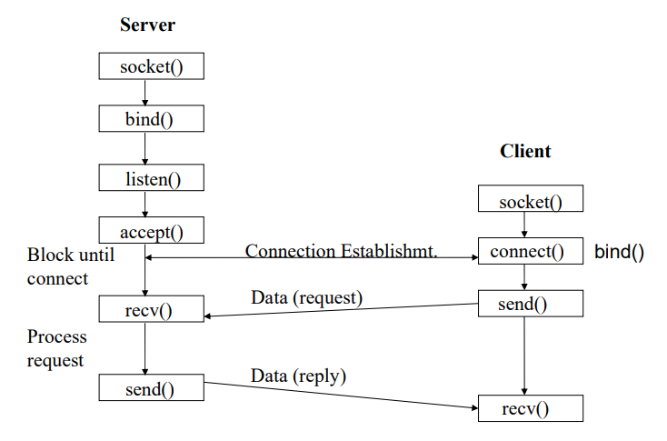
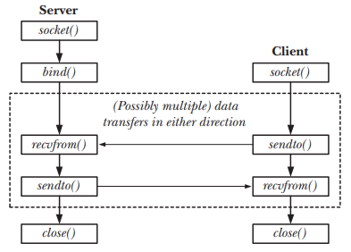
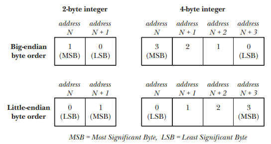

# Socket

## 1. What is socket?

- Socket is an application programming interface (API) application.
- A socket is an abstraction through which an application may send and receive data.
- A socket allows an application to plug in to the network and communicate with other applications in the same network.
- A socket is used in a client-server application framework. Most of the application-level protocols like FTP, SMTP, and POP3 make use of sockets to establish connection between client and server for exchanging data.

## 2. Communication domains

- Sockets exist in a communication domain, which determines:
  - The method of identifying a socket (i.e., the format of a socket address).
  - The range of communication.
- Modern operating systems sopport at least the following domains:
  - The UNIX (*AF_UNIX*) domain allows communication between applications on the same host.
  - The IPv4 (*AF_INET*) domain allows communication between applications running on hosts connected via an Internet Protocol version 4 network.
  - The IPv4 (*AF_INET6*) domain allows communication between applications running on hosts connected via an Internet Protocol version 6 network.
- Characteristics of socket domains:

  Domain | Communication performed | Communication between applications | Address format | Address structure
  --|--|--|--|--
  *AF_UNIX* | within kernel | on same host | pathname | *sockaddr_un*
  *AF_INET* | via IPv4 | on hosts connected via an IPv4 network | 32-bit IPv4 address + 16-bit port number | *sockaddr_in*
  *AF_INET6* | via IPv6 | on hosts connected via an IPv6 network | 128-bit IPv6 address + 16-bit port number | *sockaddr_in6*

## 3. Socket types

- There are 4 types of sockets:
  - Stream sockets: delivery in a network environment is guaranteed. These sockets use TCP as the end-to-end protocol and thus provide a reliable byte-stream service. Data records do not have any boundaries.
  - Datagram sockets: delivery in a network environtment is not guaranteed. These sockets use UDP and thus provide a best-effort datagram service. Datagrams are self-contained capsules and their boundaries are maintained.
  - Raw sockets: provide users access to the underlying communication protocols, which support socket abstractions. Raw sockets are not intended for the general user; they have been provided mainly for those interested in deverloping new communication protocols.
  - Sequenced packet sockets: is a newer technology that is not yet widely used, but tries to make use of the benefites of both stream and datagram sockets. It is provides reliable, sequenced communication that also transmit entire datagram as a unit (and hence maintain message boundaries).

## 4. Socket system calls

- The *socket()* system call creates a new socket.
- The bind() system call binds a socket to an address. Usually, a server employs this call to bind its socket to a well-known address so that clients can locate the socket.
- The *listen()* system call allows a stream socket to accept incoming connections from other sockets.
- The *accept()* system call accepts a connection from a peer application on a listening stream socket, and optionally returns the address of the peer socket.
- The *connect()* system call establishes a connection with another socket.

## 5. Stream sockets

- The operation of stream sockets:
  - In order for 2 applications to communicate, each of them must create a socket using the *socket()* system call.
  - 2 sockets are connected as follows:
    - One application calls *bind()* to bind the socket to a well-known address, and then call *listen()* to notify the kernel of it willingness to accept incoming connections.
    - The other application establishes the connection by calling *connect()*, specifying the address of the socket to which the connection is to be made.
    - The application that called *listen()* then accepts the connection using *accept()*. If the *accept()* is performed befor the peer application *connect()*, then the *accept()* blocks.
  - Once a connection has been established, data can be transmitted in both directions between the applications until one of them closes the connection using *close()*.

  

- Stream sockets are often distinguished as being either active of passive.
  - By default, a socket that has been created using *socket()* is *active*. An active socket can be used in a *connect()* call to establish a connection to a passive socket.
  - A *passive* socket (also called a listening socket) is one that has been marked to allow incoming connections by calling *listen()*.

## 6. Datagram sockets

- The operation of datagram sockets:
  - Each application that wants to send or receive datagrams creates a datagram socket using *socket()*.
  - In order to allow another application to send its datagrams, an application uses *bind()* to bind its socket to a well-known address. Typically, a server binds its socket to a well-known address, and a client initiates communication by sending a datagram to that address.
  - To send a datagram, an application calls *sendto()*, which takes as one of its arguments the address of the socket to which the datagram is to be sent.
  - In order to receive a datagram, an application calls *recvfrom()*, which may block if no datagram has yet arrived. Since *recvfrom()* allows us to otain the address of the sender, we can send a reply if desired.
  - When the socket is no longer needed, the application cloes it using *close()*.

  

- When multiple datagrams are sent from one address to another, there is no guarantee that they will arrive in the order they were sent, or even arrive at all.
- Since the underlying networking protocols may somtimes retransmit a data packet, the same datagram could arrive more than once.

## 7. Byte ordering

- There are 2 ways to store IP addersses and port numbers in memory:
  - Little-endian byte order
  - Big-endian byte order

  

- There is no standard between these two byte orderings.
- A variety of systems that can change between little-endian and big-endian by ordering.
- The byte ordering used on a particular machine is called the *host byte order*. The standard ordering used for transmiting port numbers, IP addresses and understood by all hosts on a network is called *network byte order*, and happens to be big endian.
- 4 functions to convert between host and network byte orders:
  - uint16_t **htons**(uint16_t host_uint16): Returns *host_uint16* converted to network byte order.
  - uint32_t **htonl**(uint32_t host_uint32): Returns *host_uint32* converted to network byte order.
  - uint16_t **ntohs**(uint16_t net_uint16): Returns *net_uint16* converted to host byte order.
  - uint32_t **ntohl**(uint32_t net_uint32): Returns *net_uint32* converted to host byte order.
